# BLE PER RX — 对标对比（文档/脚本 vs wifibletest）

对比对象：

| 代号 | 说明 |
| --- | --- |
| **对标** | `V3蓝牙PER_RX测试说明.md` + `V3蓝牙PER专项验证_Rev1.0.cs` |
| **本实现** | `work_station/wifi_ble/wifibletest.cpp` 中 `runBlePerRxTest()` 及相关函数 |

详细流程分别见：

- [V3蓝牙PER对标文档_测试流程总结.md](./V3蓝牙PER对标文档_测试流程总结.md)
- [wifibletest_BLE_PER_RX_测试流程.md](./wifibletest_BLE_PER_RX_测试流程.md)

---

## 1. 结论摘要

| 维度 | 是否对齐 | 说明 |
| --- | --- | --- |
| **测试方式（RX/PER 原理）** | **是** | DUT HCI 非信令收包 + CMW GPRF ARB 发包 + Test End 读 RxCount，公式一致 |
| **单场景指令顺序** | **是** | Reset → Start RX → CMW 切频触发 → Test End → 算 PER |
| **HCI 命令与应答校验** | **是** | 默认 HEX、片段 `030C00`/`332000`/`1F2000` 一致 |
| **频点/信道/PHY 映射** | **是** | 默认三频 1M，LOW/MID/HIGH 别名一致 |
| **产线集成方式** | **否（设计差异）** | 对标为独立专项；本实现嵌在 WiFi/BLE 全流程 |
| **默认参数/开关** | **部分一致** | 多项默认值不同，需靠 ini 对齐现场 |
| **Shell/非信令** | **部分一致** | 命令相同，本实现不校验 Shell 回包 |
| **CMW 细节** | **部分一致** | 支持 SCOunt 轮询；缺命令间延时、缺 ARB 停发 |
| **异常与复测策略** | **部分一致** | 复测次数默认更少；无 CMW 不可复测分类 |

**总体**：核心 **RX PER 测试方式已对标**；差异主要在 **工站上下文、默认值、Shell/CMW 边角与健壮性**。现场若要与脚本行为一致，建议按 §4 调整 `上位机设置.ini` 中 `BlePer/` 项。

---

## 2. 流程对比总图

```mermaid
flowchart TB
    subgraph ref [对标脚本 MainTest]
        R1[V3 Shell 连接] --> R2[enter 产测]
        R2 --> R3[bt-nonsig-on + 应答校验]
        R3 --> R4[关 Shell 默认开]
        R4 --> R5[CMW + HCI]
        R5 --> R6[三频 PER]
    end

    subgraph wifi [wifibletest]
        W0[整站: 连接/FacMode/RSSI] --> W1[bt-nonsig-on 无应答校验]
        W1 --> W2[关 Shell 默认关]
        W2 --> W3[CMW + HCI]
        W3 --> W4[三频 PER]
        W4 --> W5[继续 WiFi/电量/MES]
    end
```



---

## 3. 逐步对照表

### 3.1 准备与链路

| 环节 | 对标（脚本默认） | wifibletest | 对齐 |
| --- | --- | --- | --- |
| BLE 连接 | 独立 `V3_Exe.bat` Shell | 工站已有 dongle `at` 连接 | 机制不同，目的相同 |
| 进入产测 | `enter`（`BLE_EnterTestMode=true`） | 状态机 `FacMode` 已执行 | 等效（本站在 PER 前已完成） |
| 非信令命令 | `bt-nonsig-on` | `BlePer/NonSignalingShellCommand`，`at->sendCmd` | 命令一致 |
| 非信令应答 | 校验 `[OK]` 或 `[FAIL] None_` | **不校验** | 否 |
| 关 Shell 再 HCI | **默认 true**，延时 500 ms | **默认 false** | 否（可 ini 改） |
| CMW 连接 | VISA.Open | `Qvisa::ensureConnected` | 是 |
| HCI 串口 | 独立 `SerialPort` | `blePerUart`（可复用产品口） | 是 |
| UART Init/Exit | 支持 HEX 列表 | 支持，键名 `BlePer/...` | 是 |

### 3.2 单场景 RX / PER（核心）

| 环节 | 对标 | wifibletest | 对齐 |
| --- | --- | --- | --- |
| HCI Reset | `01030C00` | 同，可配置 | 是 |
| Start RX 格式 | `01 33 20 03 Ch Phy 00` | `buildBlePerRxStartCommand` 相同 | 是 |
| CMW 切频+触发 | `FREQuency` + `MANual:EXECute` | `runBlePerCmwScenario` 相同 | 是 |
| 发包等待 | 默认固定 1000 ms；可选 SCOunt | 同，键 `CmwWaitArbScount` | 是 |
| Test End | `011F2000` | 同 | 是 |
| RxCount 解析 | 末 2 字节小端 | `parseBlePerRxCount` 相同 | 是 |
| PER 公式 | `(TxCount-Rx)/TxCount*100` | 相同 | 是 |
| 合格判定 | `<= 30.8%` | `BlePer/MaxPercent` 默认 30.8 | 是 |
| CMW 失败后 Test End | `finally` 保证（已 Start RX 时） | CMW 失败分支内发送 | 意图一致，结构不同 |
| CMW 停发 | `TryStopBlePerCmwGprfArb` | **无** | 否 |

### 3.3 CMW 初始化与 SCPI

| 项 | 对标默认 | wifibletest 默认 | 对齐 |
| --- | --- | --- | --- |
| `CmwEnableFixedInit` | false | false | 是 |
| `CmwUseGuiRfConfig` | true | true | 是 |
| `CmwCheckErrorAfterScenario` | **true** | **false** | 否（可 ini 改 true） |
| `CmwWaitArbScount` | false | false | 是 |
| SCPI 命令间延时 | 120 ms | **无** | 否 |
| `CmwSetRfLevel` 条件 | 仅 true 时设 Level | FixedInit 时总是设 Level | 略异 |

### 3.4 复测与失败策略

| 项 | 对标默认 | wifibletest 默认 | 对齐 |
| --- | --- | --- | --- |
| 单场景最大次数 | **3** | **1** | 否（建议 ini：`MaxAttempts=3`） |
| 复测间隔 | 300 ms | 300 ms | 是 |
| 某频点失败后 | `ContinueOnFail=true` 继续 | **始终跑完所有场景** | 相近 |
| CMW/VISA 错误停复测 | 有 `IsBlePerCmwNonRetriableError` | **无** | 否 |

### 3.5 UART 时序

| 项 | 对标默认 | wifibletest 默认 |
| --- | --- | --- |
| ReadTimeoutMs | 3000 | 1000 |
| QuietMs | 120 | 30 |

现场 DUT 应答慢时，建议将 `BlePer/UartReadTimeoutMs`、`BlePer/UartQuietMs` 调到与脚本接近。

### 3.6 参数命名对照

| 对标脚本 `BlePer_Xxx` | wifibletest Ini `BlePer/Xxx` |
| --- | --- |
| `BlePer_ScenarioList` | `ScenarioList` |
| `BlePer_TxCount` | `TxCount` |
| `BlePer_MaxPercent` | `MaxPercent` |
| `BlePer_MaxAttempts` | `MaxAttempts`（回退 `RetestCount`） |
| `BlePer_UartPort` | `UartPort` |
| `BlePer_CmwVisaAddress` | `CmwVisaAddress` |
| `BlePer_EnableRxTest` | **无对标**（本实现专有总开关） |

---

## 4. 建议 ini 对齐（与脚本默认行为接近）

在 `上位机设置.ini` 增加或调整（示例）：

```ini
[BlePer]
EnableRxTest=true
ScenarioList=2402:1M,2440:1M,2480:1M
TxCount=1000
MaxPercent=30.8
MaxAttempts=3
RetestDelayMs=300
NonSignalingShellCommand=bt-nonsig-on
CloseShellBeforeHci=true
ShellToHciDelayMs=500
UartReadTimeoutMs=3000
UartQuietMs=120
CmwVisaAddress=TCPIP0::YOUR_INSTR::inst0::INSTR
CmwCheckErrorAfterScenario=true
CmwEnableFixedInit=false
CmwUseGuiRfConfig=true
VerifyHciResponse=true
```

`CmwVisaAddress` 须改为现场仪表地址；波形/功率若已在 CMW GUI 配好，保持 `CmwEnableFixedInit=false`。

---

## 5. 本实现特有项（对标无直接对应）

| 项 | 说明 |
| --- | --- |
| `BlePer/EnableRxTest` | 嵌入工站的总开关，默认关闭 |
| 触发时机 | 仅 BLE RSSI 连续通过后执行 |
| MES `BLE_PER_RX` | `pack.itemvalue` 汇总项 |
| 测试结果表 | 每频点一行 `BLE PER RX {label}` |
| `blePerRxDone` | 同一次测试内防重复执行 |

---

## 6. 仍待加强（若需与脚本完全等价）

1. **非信令 Shell 回包校验**（`[OK]` / `[FAIL] None_`）。
2. **CMW 命令间延时**（对标 120 ms，或 `BlePer/CmwCommandDelayMs` 可配置）。
3. **场景结束后 `TryStopBlePerCmwGprfArb` 等价逻辑**（停 ARB/输出）。
4. **CMW/VISA 异常时跳过该频点复测**（`IsBlePerCmwNonRetriableError`）。
5. **`finally` 式 Test End**：已 Start RX 时任意异常都保证收包结束命令。

以上不影响 PER **算法与主流程** 对标，但影响 **联调稳定性与失败形态**。

---

## 7. 快速核对清单（联调）

- [ ] `BlePer/EnableRxTest=true`
- [ ] `BlePer/CmwVisaAddress` 正确，本机构建含 `HAVE_NI_VISA`
- [ ] CMW 面板波形/功率已就绪（或 `CmwEnableFixedInit=true` 并配波形文件）
- [ ] HCI 口与 `BlePer/UartPort` 一致；非信令后是否需要 `CloseShellBeforeHci=true`
- [ ] 日志可见 `BLE_PER_UART_TX/RX`、`CMW100`、`BLE PER {频点}`
- [ ] 三频 PER 与脚本同量级（TxCount、MaxPercent 一致）

---

*对比基于当前仓库源码与 `doc/V3蓝牙PER_RX测试说明.md`、`doc/V3蓝牙PER专项验证_Rev1.0.cs`；若脚本版本升级请同步更新本文档。*
