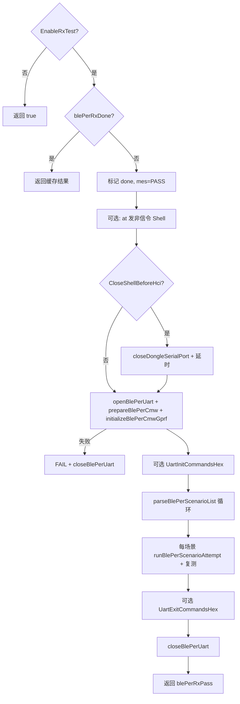
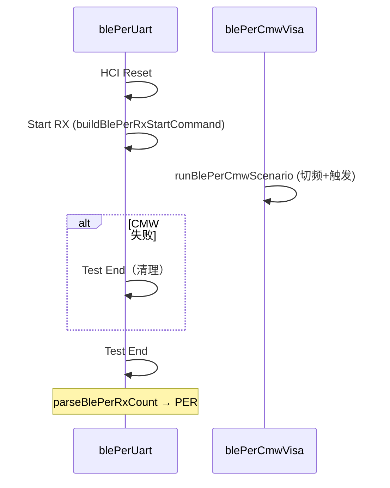

# wifibletest 工站 — BLE PER RX 测试流程

本文档描述 `work_station/wifi_ble/wifibletest.cpp` 中 **BLE PER RX** 的实现逻辑。  
配置键统一为 Ini 分类 **`BlePer/`**（`SETTINGS`，见 `上位机设置.ini`）。

实现文件：

- `work_station/wifi_ble/wifibletest.h` — 成员与函数声明
- `work_station/wifi_ble/wifibletest.cpp` — `runBlePerRxTest()` 及辅助函数
- `agreement/qvisa/qvisa.h/.cpp` — CMW100 VISA（`blePerCmwVisa`）

---

## 1. 在整站流程中的位置

PER RX **不是**独立工站，而是嵌入 WiFi/BLE 工站 `startTask()` 状态机：


| 条件 | 行为 |
| --- | --- |
| `BlePer/EnableRxTest=false`（**默认**） | `runBlePerRxTest()` 直接返回 true，不执行 PER |
| `BlePer/EnableRxTest=true` | 在 **蓝牙 RSSI 连续通过** 后调用 `runBlePerRxTest()` |
| PER 失败 | `TestResult=失败`，`pack.error=BLE_PER_RX_NG` |
| MES 上报 | `pack.itemvalue` 增加 `\|BLE_PER_RX:PASS/FAIL/未测` |

触发代码位置：`STATE_WATI_GET_CORRECT_BLERSSI` 内，RSSI 达标且 `at->sendBLELOG(0)` 之后。

**与对标脚本差异**：脚本为独立 6 步专项；本工站复用已有 **dongle 蓝牙连接 + 工厂模式**，无单独 `V3_Exe.bat` Shell 会话。

---

## 2. 总流程 `runBlePerRxTest()`



### 2.1 准备阶段

| 步骤 | 实现 | 配置键 | 默认 |
| --- | --- | --- | --- |
| 非信令 | `at->sendCmd(cmd + "\r\n")` | `NonSignalingShellCommand` | `bt-nonsig-on` |
| 是否发送 | `SendNonSignalingShellCommand` | | true |
| 发送后等待 | `AfterNonSignalingDelayMs` | | 500 ms |
| 关 Shell 再 HCI | `closeDongleSerialPort()` | `CloseShellBeforeHci` | **false** |
| Shell→HCI 延时 | `ShellToHciDelayMs` | | 300 ms |

**注意**：未校验 Shell 回包是否 `[OK]`（对标脚本有校验）。

### 2.2 资源初始化

| 资源 | 函数 | 说明 |
| --- | --- | --- |
| HCI UART | `openBlePerUart()` | 端口 `BlePer/UartPort`，空则用产品串口下拉框 |
| CMW VISA | `prepareBlePerCmw()` | `Qvisa::ensureConnected()` + `*IDN?` |
| GPRF | `initializeBlePerCmwGprf()` | `*CLS`；`CmwEnableFixedInit=true` 时完整 ARB 初始化 |

---

## 3. 单场景逻辑 `runBlePerScenarioAttempt()`

与对标文档 **顺序一致**：



| 步骤 | 函数/命令 | 默认 HEX | 校验片段 |
| --- | --- | --- | --- |
| Reset | `sendBlePerUartCommandHex` | `01030C00` | `030C00` |
| Start RX | `buildBlePerRxStartCommand` | `01 33 20 03 Ch Phy 00` | `332000` |
| CMW | `runBlePerCmwScenario` | SCPI 见 §4 | — |
| Test End | `sendBlePerUartCommandHex` | `011F2000` | `1F2000` |
| PER | `parseBlePerRxCount` | 末 2 字节小端 | — |

**PER 公式**（与对标一致）：

```cpp
PER = (TxCount - rxCount) / TxCount * 100.0
通过: per <= BlePer/MaxPercent  // 默认 30.8
```

**与脚本差异**：

- CMW 失败时 inline 发 Test End，**无** `TryStopBlePerCmwGprfArb()`。
- 无 `finally` 结构；Start RX 成功后 CMW 异常会先发 Test End 再返回 false。

---

## 4. CMW100 `runBlePerCmwScenario()` / `waitBlePerCmwArbComplete()`

| 动作 | SCPI |
| --- | --- |
| 清状态 | `*CLS` |
| 切频 | `SOURce:GPRF:GEN:RFSettings:FREQuency {MHz}MHz` |
| 非 GUI 配置时 | `ARB:REPetition`、`ARB:CYCLes`（`CmwUseGuiRfConfig=false`） |
| 触发 | `TRIGger:GPRF:GEN:ARB:MANual:EXECute` |
| 等待 | `CmwWaitArbScount=false` → `CmwTriggerWaitMs`（默认 1000）；`=true` → 轮询 `ARB:SCOunt?` |
| 查错 | `CmwCheckErrorAfterScenario`（**默认 false**） |

固定初始化 `initializeBlePerCmwGprf()`（`CmwEnableFixedInit=true` 时）：

- `BBMode ARB`、`CYCLes`、`REPetition`、`LEVel`、`STATe ON;*OPC?`
- `RETRigger ON`、`AUTostart ON`、可选 `ARB:FILE`

**与脚本差异**：`Qvisa` 写命令后 **无** 对标脚本的 `CmwCommandDelayMs`（120 ms）固定延时。

---

## 5. 场景解析与信道

`parseBlePerScenarioList()` / `frequencyToBlePerChannel()`：

- 列表：`BlePer/ScenarioList`，默认 `2402:1M,2440:1M,2480:1M`
- 别名 LOW/MID/HIGH → 2402/2440/2480
- PHY：1M→0x01，2M→0x02
- 信道：2402→0，2440→19，2480→39，其它 `freq-2402`

---

## 6. HCI UART `sendBlePerUartCommandHex()`

- 写前 `clear`，日志 `BLE_PER_UART_TX/RX` + 紧凑 HEX
- 读超时：`UartReadTimeoutMs`（默认 **1000**，脚本 3000）
- 静默结束：`UartQuietMs`（默认 **30**，脚本 120）
- 循环中 `QCoreApplication::processEvents()` 避免界面卡死

---

## 7. 复测与结果展示

| 配置 | 默认 | 说明 |
| --- | --- | --- |
| `MaxAttempts` / `RetestCount` | **1** | 脚本默认 3 |
| `RetestDelayMs` | 300 | 复测间隔 |
| 失败继续 | **始终测完所有场景** | 脚本有 `BlePer_ContinueOnFail` |

每个场景写入 `testItems` 表格：

- 名称：`BLE PER RX {label}`
- 数据：`Rx=x/Tx=y, PER=z%`
- 合格线：`<= MaxPercent%`

---

## 8. 主要配置键一览（Ini `BlePer/`）

| 键 | 默认 | 用途 |
| --- | --- | --- |
| `EnableRxTest` | false | 总开关 |
| `ScenarioList` | 三频 1M | 场景列表 |
| `TxCount` | 1000 | PER 分母 |
| `MaxPercent` | 30.8 | PER 上限 |
| `MaxAttempts` / `RetestCount` | 1 | 复测次数 |
| `UartPort` / `UartBaudRate` | 产品口 / productBaudRate | HCI 串口 |
| `HciResetHex` / `HciTestEndHex` | 见上 | HCI 命令 |
| `VerifyHciResponse` | true | 应答片段校验 |
| `NonSignalingShellCommand` | bt-nonsig-on | 非信令 |
| `CloseShellBeforeHci` | false | 关 dongle 口 |
| `CmwVisaAddress` | （必填） | VISA 地址 |
| `CmwEnableFixedInit` | false | 完整 GPRF 初始化 |
| `CmwUseGuiRfConfig` | true | 场景内不改 REP/CYCLes |
| `CmwWaitArbScount` | false | SCOunt 轮询 |
| `CmwCheckErrorAfterScenario` | false | 场景后 SYST:ERR? |
| `CmwTriggerWaitMs` | 1000 | 固定等待发包 |
| `UartInitCommandsHex` / `UartExitCommandsHex` | 空 | 串口前后附加命令 |

完整键名以 `wifibletest.cpp` 中 `SETTINGS.value(QStringLiteral("BlePer/..."))` 为准。

---

## 9. 依赖与编译

- **NI-VISA**：`new_production.pro` 检测到 `visa.h` 时 `DEFINES += HAVE_NI_VISA`；未启用则 `Qvisa::ensureConnected()` 恒失败。
- **产测前置**：PER 执行前工站已完成 dongle 连接、`FacMode`、`BaseInfo`、BLE RSSI 等步骤。

---

## 10. 函数与源码行号（约）

| 函数 | 作用 |
| --- | --- |
| `parseBlePerScenarioList` | 解析场景 |
| `buildBlePerRxStartCommand` | 组 Start RX |
| `openBlePerUart` / `closeBlePerUart` | HCI 串口 |
| `sendBlePerUartCommandHex` | 发 HEX 收应答 |
| `parseBlePerRxCount` | 解析收包数 |
| `prepareBlePerCmw` / `initializeBlePerCmwGprf` | CMW 连接与初始化 |
| `runBlePerCmwScenario` / `waitBlePerCmwArbComplete` | 发包与等待 |
| `runBlePerScenarioAttempt` | 单场景一次尝试 |
| `runBlePerRxTest` | 总入口 |

---

*启用 PER 前请在 `上位机设置.ini` 配置 `BlePer/CmwVisaAddress` 等项，并设 `BlePer/EnableRxTest=true`。*
