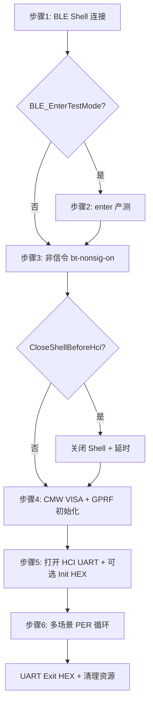
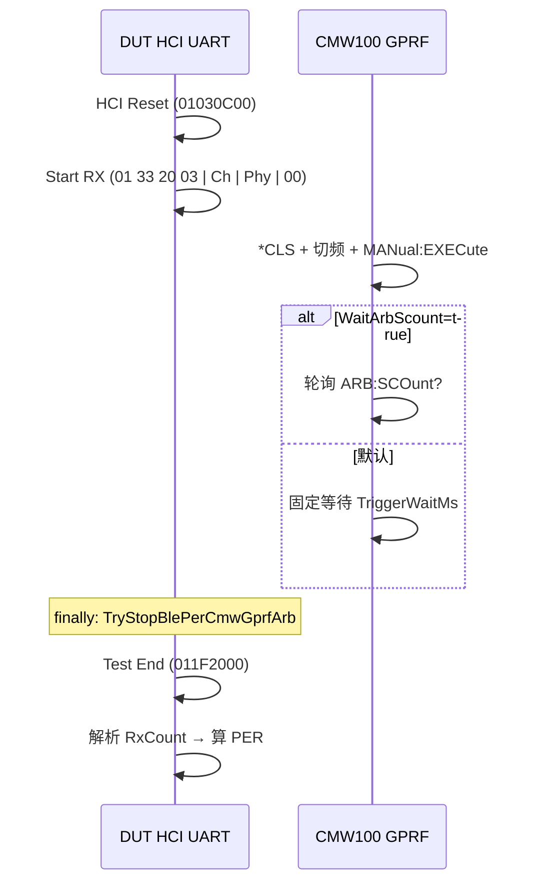

# V3 蓝牙 PER 对标文档 — 测试流程总结

本文档汇总仓库内两份 **BLE PER RX** 对标来源的实现逻辑，供与 `wifibletest` 工站对照。

| 文档 | 路径 | 性质 |
| --- | --- | --- |
| RX 说明 | `doc/V3蓝牙PER_RX测试说明.md` | 从专项脚本提炼的流程说明 |
| 专项脚本 | `doc/V3蓝牙PER专项验证_Rev1.0.cs` | 可执行的独立验证脚本（C#） |

两份内容同源：**DUT HCI 非信令 RX 收包** + **CMW100 GPRF ARB 发包**，在可配置频点上计算 **BLE RX PER**。

---

## 1. 脚本/文档定位

- **只做**：BLE Shell、可选产测准备、非信令、HCI UART、CMW100 VISA、多频点 PER。
- **不做**：MES、写 SN、三元组、显示测试、complete、API 上报等产线全流程。
- **默认频点**：2402 / 2440 / 2480 MHz，PHY 默认 1M（`BlePer_ScenarioList = 2402:1M,2440:1M,2480:1M`）。

---

## 2. 主流程（`MainTest`，步骤 1～6）



| 步骤 | 脚本函数/动作 | 关键参数 |
| --- | --- | --- |
| 1 | `ConnectBleShell()` | `V3_ExePath`、`BLE_ConnectMode`、`BLE_DeviceMac` |
| 2 | `EnterTestMode()` → 发 `enter` | `BLE_EnterTestMode`（默认 true） |
| 3 | `EnterBlePerNonSignalingMode()` | `BlePer_NonSignalingShellCommand`（默认 `bt-nonsig-on`） |
| 切换 | `CloseShell()` + `BleDisconnectSettleMs` | `BlePer_CloseShellBeforeHci`（**默认 true**） |
| 4 | `InitializeBlePerCmw()` + `InitializeBlePerCmwGprfArb()` | `BlePer_CmwVisaAddress`、`BlePer_CmwEnableFixedInit`（默认 false） |
| 5 | `OpenBlePerSerialPort()` + Init HEX 列表 | `BlePer_UartPort`、`BlePer_UartInitCommandsHex` |
| 6 | `RunBlePerAllScenarios()` | 见下文单场景逻辑 |
| 收尾 | Exit HEX、`SafeCleanupAsync()` | `BlePer_UartExitCommandsHex` |

### 2.1 非信令进入（脚本特有校验）

- 未配置非信令命令且 `BlePer_RequireNonSignalingShellCommand=true` → **抛错**，禁止进 HCI RX。
- 应答判定：`[OK]`，或 `[FAIL]` 且含 `None_`（现场定义为已进入非信令）。
- 成功后 `BlePer_PrepareDelayMs`（默认 300 ms）等待。

---

## 3. 单场景 RX / PER 核心逻辑

对每个 `(频点 MHz, PHY)` 场景，脚本在 `RunBlePerScenarioAttempt` 中执行：



| 序号 | 动作 | 默认 HEX / SCPI | 应答/校验 |
| --- | --- | --- | --- |
| 1 | HCI Reset | `01030C00` | 含 `030C00` |
| 2 | Start RX | `01 33 20 03 \| Channel \| Phy \| 00` | 含 `332000` |
| 3 | CMW 发包 | `FREQuency {MHz}MHz` + `MANual:EXECute` | 可选 `SCOunt?` 或固定延时 |
| 4 | HCI Test End | `011F2000` | 含 `1F2000` |
| 5 | 算 PER | — | 见下式 |

**PER 公式**（与说明文档一致）：

```text
RxCount = Test End 应答最后 2 字节（小端 uint16）
PER(%) = (BlePer_TxCount - RxCount) / BlePer_TxCount × 100
通过条件: TxCount > 0 且 RxCount >= 0 且 PER <= BlePer_MaxPercent（默认 30.8%）
```

**脚本异常保护**：CMW 失败时 `finally` 仍会尝试 `Test End`（若已 Start RX），并 `TryStopBlePerCmwGprfArb()`。

---

## 4. 频点与信道映射

| 频点 (MHz) | 信道索引 | 别名 |
| --- | --- | --- |
| 2402 | 0 | LOW |
| 2440 | 19 | MID |
| 2480 | 39 | HIGH |
| 其它 2402～2480 | freq - 2402 | — |

PHY：`1M` → `0x01`，`2M` → `0x02`。

---

## 5. CMW100 GPRF ARB（脚本）

### 5.1 连接与初始化

- `*IDN?` 读仪表信息。
- `InitializeBlePerCmwGprfArb()`：
  - `BlePer_CmwEnableFixedInit=false`（**默认**）：仅 `*CLS`，依赖 GUI 已配波形/功率，后续场景只切频+触发。
  - `=true`：`BBMode ARB`、`CYCLes`、`REPetition`、`LEVel`、`STATe ON`、`RETRigger/AUTostart`、`ARB:FILE` 等。

### 5.2 单场景发包

- `*CLS` → `FREQuency {MHz}MHz`
- 若 `BlePer_CmwUseGuiRfConfig=false`：再发 `ARB:REPetition`、`ARB:CYCLes`
- `TRIGger:GPRF:GEN:ARB:MANual:EXECute`
- 等待方式：
  - **默认** `BlePer_CmwWaitArbScount=false`：固定 `BlePer_CmwTriggerWaitMs`（1000 ms）
  - `=true`：轮询 `SOURce:GPRF:GEN:ARB:SCOunt?` 至 `BlePer_CmwArbCompleteCycles`（默认 cycles-1）或超时
- `BlePer_CmwCheckErrorAfterScenario`（**默认 true**）：`SYSTem:ERRor?`

每条 SCPI 写/读后 `BlePer_CmwCommandDelayMs`（默认 120 ms）延时。

---

## 6. 复测与失败策略

| 参数 | 默认值 | 含义 |
| --- | --- | --- |
| `BlePer_MaxAttempts` | 3（或 `BlePer_RetestCount`） | 单场景最大尝试次数 |
| `BlePer_RetestDelayMs` | 300 | 复测间隔 |
| `BlePer_ContinueOnFail` | true | 某频点失败后是否继续测其它频点 |
| CMW 不可复测错误 | — | 含 CMW100/SCOunt/VISA/VI_ERROR 时停止该频点复测 |

---

## 7. HCI UART 通讯（脚本）

| 参数 | 默认值 |
| --- | --- |
| `BlePer_UartReadTimeoutMs` | 3000 |
| `BlePer_UartQuietMs` | 120 |
| `BlePer_VerifyHciResponse` | true |

日志关键字：`BLE_PER_UART_TX/RX`、`BLE PER`、`CMW100`。

---

## 8. 源码索引（`V3蓝牙PER专项验证_Rev1.0.cs`）

| 内容 | 约略行号 |
| --- | --- |
| 参数定义 | L33–L86 |
| `MainTest` | L91–L172 |
| `EnterBlePerNonSignalingMode` | L366–L397 |
| `RunBlePerAllScenarios` / 复测 | L485–L575 |
| `RunBlePerScenarioAttempt` | L602–L662 |
| `BuildBlePerRxStartHex` / 信道 | L664–L726 |
| CMW 初始化/场景/SCOunt | L728–L871 |
| UART 收发 / `ParseBlePerRxCount` | L1007 起 |

---

## 9. 与 `V3蓝牙PER_RX测试说明.md` 的关系

- **说明文档** = 脚本的结构化摘录（主流程、单场景、参数表、默认三频点指令表）。
- **脚本** = 可执行真源；参数默认值、非信令应答判定、`finally` Test End、CMW 停发等细节以 **`.cs` 为准**。
- 两份对标文档在 **RX/PER 算法与 HCI/CMW 指令顺序** 上是一致的。

---

*现场以 ini/脚本实际参数与固件 HCI 规范为准。*
