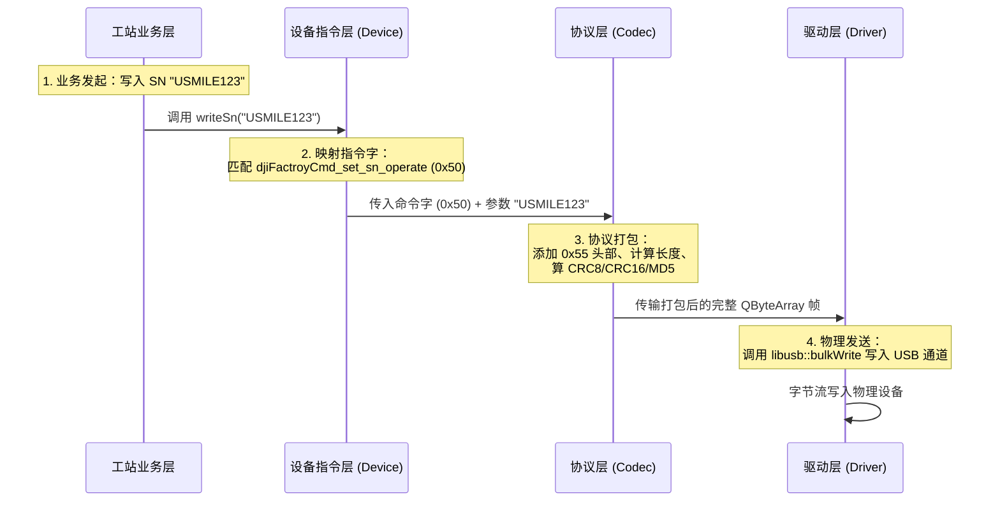

# agreement 协议与指令集概念说明

本文档用于阐述在 `agreement` 协议分层重构架构中，**“协议 (Protocol)”** 与 **“指令集 (Command Set)”** 的定义、职责边界以及在项目中的具体代码实现。

---

## 1. 协议 (Protocol)

### 1.1 定义
**协议**定义了数据在物理或逻辑通道（如串口、USB Bulk、TCP、本地进程）中传输的**帧结构、打包格式、校验规则和断帧（断句）约定**。

它不关心数据内容的具体业务含义（例如“读电压”还是“重启”），它只负责回答：
*   **如何识别一帧数据的开始与结束？**（如 Magic 头部、结束标志、换行符）
*   **如何确保传输的数据是完整且未损坏的？**（如 CRC 校验、和校验、加密）
*   **数据如何序列化为字节流？**（如 Protobuf、JSON、二进制结构体）

### 1.2 在代码中的对应
对应重构设计中的 **Codec（编解码）层**。

### 1.3 典型例子
*   **SCPI 协议**：约定所有数据为 **ASCII 文本**，指令树用 `:` 分隔，且每帧必须以 **换行符 `\n` 或 `\r\n` 结尾** 进行断帧。
*   **Modbus RTU 协议**：约定帧结构为 `[设备地址(1B)] + [功能码(1B)] + [数据区(NB)] + [CRC16校验(2B)]`，通过字符间的空闲时间（3.5 字节时间）进行物理断帧。
*   **DJI Bulk 协议**（`qbulk` 内）：约定数据帧必须以 `0x55` 开头，包含帧长度、协议版本、头部 CRC8 校验、数据 Payload，以及尾部的 CRC16 校验与加密字段。
*   **FCTP 协议**（Dongle 产测）：约定基于 Protobuf 序列化后的字节包，加上外层的 Magic 头和 Sum 校验。

---

## 2. 指令集 (Command Set)

### 2.1 定义
**指令集**是双方（如上位机与设备）约定的**具体控制命令字（Command ID）、寄存器地址或文本指令及其对应的功能语义和参数格式**。

它不关心底层数据是怎么打包和校验的，它只负责回答：
*   **要控制设备执行什么具体的动作？**（如：读取电流、打开开关、写入 SN、重启）
*   **这条命令需要携带什么参数？返回什么数据结构？**

### 2.2 在代码中的对应
对应重构设计中的 **Device（设备）层** 或 **Access 层的 Cmd 枚举**。

### 2.3 典型例子
*   **SCPI 指令集**：
    *   `*IDN?`（查询设备信息）
    *   `MEASure:CURRent?`（读取电流值）
    *   `OUTPut ON`（打开程控电源输出）
*   **Modbus 指令集（线圈与寄存器地址）**：
    *   寄存器 `0x0001`：写入 `1` 启动电机，写入 `0` 停止。
    *   寄存器 `0x0005`：读取待机电流值。
*   **`qbulk` 指令集**（`djiFactroyCmd` 枚举）：
    *   `0x01`（`djiFactroyCmd_get_version`，读取版本）
    *   `0x50`（`djiFactroyCmd_set_sn_operate`，写入 SN）
    *   `0xf4`（`djiFactroyCmd_amt_task_start`，启动产测任务）
*   **Dongle AT 指令集**（`DongleCmd` 枚举）：
    *   `AT+MAC=`（扫描连接蓝牙 MAC）
    *   `AT+BLE=`（连接 BLE）
    *   `AT+OTA=`（启动 OTA）

---

## 3. 协议与指令集的协作关系

当你在工站业务中需要执行一个操作时，数据会依次经过**指令集层**、**协议层**和**驱动层**。

### 3.1 协作流程示例：通过 USB Bulk 写入 SN

---

## 4. 为什么要区分协议与指令集？

这种分层设计带来了极高的灵活性和可维护性：

1.  **传输复用**：
    例如，你可以在同一条串口通道上运行不同的**协议**（同时跑 `AT 协议` 和 `FCTP 协议`），因为协议层只负责把各自的字节帧送出去或拼起来，互不干扰。
2.  **指令解耦**：
    如果未来的新设备更新了底层的通讯**协议**（例如，打包格式从二进制包改成了 JSON 包，或者增加了更复杂的校验和加密），我们**只需要修改 Codec 协议打包层，而上层工站里调用“写入 SN (0x50)”的指令和业务逻辑完全不需要改动一行**。
3.  **设备适配**：
    不同的设备可能使用相同的**协议**（如 Modbus），但有着完全不同的**指令集**（如 PLC 寄存器地址与电流表寄存器地址完全不同）。我们可以共用同一个 Modbus Codec 协议解析器，只为每个设备单独实现自己的 Device 命令映射文件。

---

## 5. 剩余遗留目录（qbulk/qat/qadb等）重构评估与建议

在 `agreement` 目录下，目前还存留了一些尚未完全按新架构重构的目录（如 `qbulk`, `qat`, `qadb`, `qshell`, `qmes`）。基于**“驱动与协议分离”**与**“一外设一模块”**的核心理念，坚决不建议将它们强行合并到已有的 `scpi`、`modbus` 或 `factory_protocol` 目录中（这会导致物理通道差异性冲突与违背单一职责）。

相反，建议采取“升级为独立协议域”或“剥离出协议层”的策略：

### 5.1 `qbulk`（大疆 USB Bulk 产测协议）
* **评价**：`qbulk` 是高度定制的二进制协议，不仅通道特殊（依赖 `libusb` 操作 USB Endpoint），且封包特殊（Magic 0x55、头部 CRC8、整包 CRC16、MD5 校验）。
* **重构建议（升级为独立协议域）**：
  新建独立的 **`dji_bulk_protocol`** 目录，严格拆分为四层：
  1. **Driver 层**：提取纯粹的 `UsbBulkChannel`，只负责 `libusb` 的收发操作。
  2. **Codec 层**：提取 `DjiBulkCodec`，专职负责 0x55 帧头、计算 CRC 和 MD5 的打包与解包。
  3. **Device 层**：新建 `DjiProductBulkDevice`，负责将现有的 `djiFactroyCmd` 枚举映射成各个指令需要的具体参数。
  4. **Manager/Access 层**：提供 `QBulkManager` 作为工站入口屏蔽底层细节。

### 5.2 `qat`（Dongle AT 指令集）
* **评价**：虽然 AT 指令和 SCPI 类似都是基于 ASCII 字符串和 `\r\n` 回车换行，但它们的路由规则、指令树结构完全不同，且 `qat` 是与 `factory_protocol` 并行跑在同一根 Dongle 串口上的。
* **重构建议（独立域并复用底层通道）**：
  新建独立的 **`at_protocol`** 目录：
  1. **通道复用**：彻底剥离 `Qat` 对 `QSerialPort` 的直接占有，接收端复用通用的 `QSerialPortReader`。
  2. **Codec 层**：复用一个通用的 `LineCodec`（按换行符切帧）。
  3. **Device 层**：保留现有的 `DongleCmd` 枚举，专注负责将枚举转换为 `AT+MAC=` 等字符串并解析回包。

### 5.3 `qadb` 与 `qshell`（宿主机进程通道）
* **评价**：这两个类本质上是 **“宿主机操作系统工具”**，用来拉起 `adb.exe` 和 `powershell.exe`。它们实际上不属于嵌入式硬件通讯协议，继续放在负责硬件交互的 `agreement` 目录中职责有些越界，且目前还在使用裸字符串指令。
* **重构建议（移出协议层或重构为服务组件）**：
  * **建议方案 A（移出）**：将它们从 `agreement` 移出，放到根目录下的 **`services/`**目录中。
  * **如果非要留在 agreement（四层改造）**：将其改造为 `process_protocol` 域。底层 Driver 使用已有的 `QProcessChannel`。上层封装成例如 `QAdbDevice::readDeviceJson()` 或 `QShellDevice::executeTestScript(scriptName)` 的类型安全接口，彻底消灭业务层中的 `adb->sendCommand("cat ...")` 裸字符串代码。

### 5.4 `qmes`（云端系统对接）
* **评价**：MES 对接走的是 HTTP/HTTPS 协议，它是典型的云端业务层代码。
* **重构建议（剥离）**：与 `tuple`（三元组）的重构思路一致，MES 业务应该属于“工站流程业务封装”，强烈建议移出 `agreement`，放到根目录下的 `services/`** 目录中。
