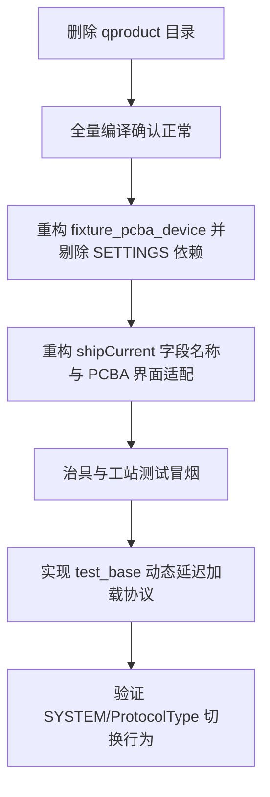

# agreement 协议层后续重构与有序优化方案

> 替代与承接现有重构成果，针对 `agreement` 协议层现存的冗余代码、兼容逻辑、性能开销以及未完全收拢的量测数据流，制定一份有序的优化实施指南。
> **目标**：彻底消除磁盘冗余、统一量测类型命名体系、优化治具长包解析性能、按需加载协议以降低开销。

---

## 1. 优化阶段与优先级总览

优化工作遵循**“由易到难、先清理后重构、渐进式演进”**的原则，共分为四个阶段：

| 阶段 / 优先级 | 任务主题 | 冗余/优化本质 | 涉及核心文件 |
| :--- | :--- | :--- | :--- |
| **阶段 0 / 立即执行** | **磁盘残留目录清理** | `qproduct` 重复，已不被构建编译。 | `agreement/qproduct/` (删除) |
| **阶段 1 / P0 级** | **治具 PCBA 解析收敛与字段澄清** | 废除 settings 隐式协议分支，解决 `shipCurrent` 一词多义。 | `fixture_pcba_device.cpp`<br>`fixture_uart_types.h` |
| **阶段 2 / P1 级** | **治具多协议过滤与收帧公共化** | 避免每次收包全文本匹配，提取 Dongle/相机/治具的相似收帧逻辑。 | `fixture_pcba_device.cpp`<br>`mainlogic.cpp`<br>`cameratest.cpp` |
| **阶段 3 / P2 级** | **双栈延迟加载与瘦身** | `test_base` 内一次性 new 出了所有协议，应改为按需动态实例化。 | `test_base.cpp` |
| **阶段 4 / 长期级** | **统一量测数据流与状态机解耦** | 使用 `ProtocolMeasureData` 结构体归一化 SCPI/Modbus 电流、电压、温度等上报。 | `qscpimanager.h`<br>`qprotocol_types.h` |

---

## 2. 阶段 0：磁盘残留目录清理 (立即执行)

### 2.1 现状与冗余
在协议重构中，产品串口逻辑已正式归纳至 `agreement/product_serial/protocol/qproduct.h|.cpp` 路径下，但根目录下的 `agreement/qproduct/` 依旧存在旧代码残留，由于 `INCLUDEPATH` 已经剔除该路径，该文件夹为纯磁盘多余文件。

###   2.2 优化动作
- 从磁盘中彻底删除 `agreement/qproduct/` 目录。
- 确认 [new_production.pro](file:///f:/C/test/new_production.pro) 中无任何对 `agreement/qproduct` 的包含及源文件引用。

---

## 3. 阶段 1：治具 PCBA 解析收敛与字段澄清 (P0 优先级)

### 3.1 废除 PCBA 旧解析分支
*   **现状**：
    [fixture_pcba_device.cpp](file:///f:/C/test/agreement/fixture/device/fixture_pcba_device.cpp) 中，`parseFixturePacket` 函数中保留了基于 `SETTINGS` 中 `SYSTEM/TestAudioCurrent` 和 `SYSTEM/TestShippingCurrent` 标志的兼容旧解析逻辑（如读取字节 12 作为音频状态，或者读取 17 字节作为错误码）。
*   **问题**：
    隐式依赖配置文件导致测试矩阵翻倍，极易在产线部署时因为 INI 缺失导致解析行为异常。
*   **优化方案**：
    若当前硬件均已升级到定版协议（即 V2 长包，`length=0x17` 或 `0x18`），直接移除 `parseFixturePacket` 内部对旧版本包的 `SETTINGS` 判断。若有必要，仅保留大版本号宏或 `declaredLen` 条件隔离，默认直接按定版协议偏移量解析：
    - `musicCurrent` 固定在字节 12~13
    - `standbyCurrentUa` 固定在字节 14~15
    - `fixerro` 固定在字节 22（若 length=18）

### 3.2 拆分多义性字段 `shipCurrent`
*   **现状**：
    传统 PCBA 状态机和数据结构 `FixturePacketData` 中的 `shipCurrent`（实际上是 `standbyCurrentUa`）容易让人产生误解。而在自由工站用例卡控中，该属性已被正确标识为“待机电流”。
*   **优化方案**：
    1. 在 `FixturePacketData` 结构体中，移除带有歧义的 `shipCurrent`（或将其标为 `deprecated`）。
    2. 新增字段：
       - `uint16_t cargoCurrentUa`：代表“船运电流”。
       - `uint16_t standbyCurrentUa`：代表“待机电流”。
    3. 同步修改传统 PCBA 界面展示与卡控逻辑，使得业务层代码意图极其精确。

---

## 4. 阶段 2：治具多协议过滤与收帧公共化 (P1 优先级)

### 4.1 治具多协议同通道的配置过滤
*   **现状**：
    `Fixture_uart` 在接收到串口包时，会将字节流抛给多个解析器（PCBA、IMU 角度、压感、相机）。即便工站只启用了 PCBA 功能，依旧在后台对每一帧运行其他类型的文本匹配。
*   **优化方案**：
    1. 引入治具配置文件枚举 `FixtureUartProfile`：
       ```cpp
       enum class FixtureUartProfile {
           PcbaOnly,
           PressOnly,
           ImuOnly,
           Mixed
       };
       ```
    2. 在治具串口初始化或工站加载时，通过配置设置当前的 Profile。
    3. 在数据接收槽函数中，根据 Profile 跳过非激活协议的解析函数，降低不必要的 CPU 与内存开销。

### 4.2 提取公共 `RingFrameReader`
*   **现状**：
    `mainlogic.cpp` (MainWindow)、`cameratest.cpp` 和 `fixture_pcba_device.cpp` 中存在完全雷同的 `RingBuf` 收包状态机：
    ```text
    读取缓存 -> 匹配 Magic(0x55/0xCC) -> 读取 Length -> 截取完整帧 -> 尾部校验(0xAA) -> 删除已处理帧
    ```
*   **优化方案**：
    1. 在 `agreement/qtransport/` 下封装一个 `RingFrameReader` 类：
       ```cpp
       class RingFrameReader {
       public:
           struct Config {
               uint8_t magic;
               int headSize;
               int lengthOffset;
               uint8_t tailMarker;
           };
           // 传入配置与 RingBuf，提供通用的帧提取接口
       };
       ```
    2. 各业务层只需要传入特定的帧格式结构，调用 `RingFrameReader` 即可，避免同名结构体和解析器的重复拷贝。

---

## 5. 阶段 3：双栈延迟加载与瘦身 (P2 优先级)

### 5.1 痛点与消耗
在 [test_base.cpp](file:///f:/C/test/work_station/test_base.cpp) 构造函数中，每次都会执行：
```cpp
pb(new Qpb(dongleSerialPort)),
qfctp(new Qfctp(dongleSerialPort)),
qaiot(new Qaiot(dongleSerialPort)),
qroot(new Qroot(dongleSerialPort)),
at(new Qat(dongleSerialPort)),
```
由于这些协议对象会占用 Dongle 物理串口的读写句柄，甚至有独立线程与定时器，而实际测试时仅会按照产品线使用其中一种协议。这造成了严重的资源浪费。

### 5.2 优化方案
1. 将 `pb`, `qfctp`, `qaiot`, `qroot` 等对象指针修改为默认 `nullptr`。
2. 抽离协议初始化函数 `test_base::initializeProtocol()`：
   ```cpp
   void test_base::initializeProtocol() {
       const QString protocolName = SETTINGS.value("SYSTEM/ProtocolType", "qpb").toString();
       if (protocolName == "qpb" && !pb) {
           pb = new Qpb(dongleSerialPort, this);
           protocolManager.bindQpb(pb);
       } else if (protocolName == "qfctp" && !qfctp) {
           qfctp = new Qfctp(dongleSerialPort, this);
           protocolManager.bindQfctp(qfctp);
       }
       // 仅在此时对 protocolManager 绑定并更新当前激活类型
   }
   ```
3. 在工站实际打开串口或测试准备阶段执行该动态实例化，实现动态延迟加载。

---

## 6. 阶段 4：长期级架构演进方向 (测量流与状态观测)

### 6.1 统一量测数据流 (`ProtocolMeasureData`)
目前，即使废弃了 `Qusb` 并将 `ammeterReadingReceived` 泛化为 `measureReadingReceived`，底层依然抛出的是 `QString`，且电压、电流、功率等传感器各自为政。
*   **优化目标**：
    在 `qprotocol_types.h` 中引入统一的传感器/测量数据结构：
    ```cpp
    struct ProtocolMeasureData {
        QString deviceName;  // "huiling_wfp60h", "hq_ammeter" 等
        QString channel;     // "CH1", "CH2"
        QString type;        // "Current" (电流), "Voltage" (电压), "Temp" (温度)
        double value = 0.0;
        QString unit;        // "mA", "V", "C"
        bool isOk = true;
    };
    Q_DECLARE_METATYPE(ProtocolMeasureData)
    ```
*   **落地动作**：
    - 改造 `QScpiManager` 与 `QModbusManager`，在回包解析完毕后统一转化为 `ProtocolMeasureData`。
    - 只发射单一信号：`void measurementReceived(const ProtocolMeasureData& data)`。
    - 自由工站卡控层 `GateRegistry` 只需接入这一种数据，不再区分电压、电流的各个信号源。

### 6.2 引入统一状态观测器 (`TransportStatusObserver`)
目前，串口连接状态（如“串口已打开”、“串口无权限/断开”）直接操作 UI 控件。
*   **优化方案**：
    1. 封装一个状态观测者接口 `TransportStatusObserver`。
    2. 各个 `SerialPortController` 上报 `Connected` / `Disconnected` / `Error` 状态。
    3. 工站层连接状态统一在此汇总，实现通讯底层与 UI 界面的彻底解耦，提高界面的稳定性与测试容错率。

---

## 7. 实施与验证步骤建议

对于以上规划的 1~3 阶段，推荐在进行重构时按以下顺序逐步落地：



### 验证方法
1.  **静态验证**：每次修改后，执行 `qmake` 并全量编译，确保无语法与头文件缺失问题。
2.  **动态抓包**：使用治具串口抓包工具或电流表通信监视器，比对优化前后的指令响应速度及 CPU 占用。
3.  **灰度部署**：在新版本投入产线前，至少在单台测试机（Beta 工站）平稳运行 3 天以上，观察是否有内存泄漏和串口拔插异常。
