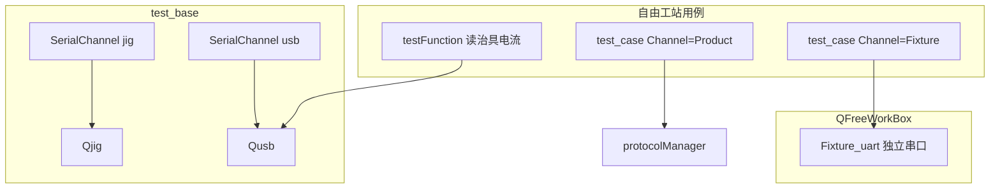

# agreement 外设与治具说明（fixture / jig / usb）

> 说明 `fixture`、`jig`、`usb` 在 `agreement/` 中的职责差异。  
> **自由工站视角**：仅 **fixture（PCBA）** 与 **usb（电流表）** 参与测试编排；**jig** 仅 jig 口开/关与收包。

配套：[自由工站协议调用说明.md](./自由工站协议调用说明.md)

---

## 1. 一句话区别

| 模块 | 是什么 | 串口 | 协议 |
|------|--------|------|------|
| **fixture**（`Fixture_uart`） | 治具调试 UI + PCBA 等多协议串口 | **独立 COM**（`FixturecomNameCombo`） | `codec/fixture`：0x55 PCBA、Press、IMU、Camera |
| **jig**（`Qjig`） | 气缸/继电器/托盘机械控制 | **jig COM**（`jigComNameCombo`） | 硬编码 hex / ASCII（`5501050001`、`ctl_down\r\n`） |
| **usb**（`Qusb`） | USB 电流表 / 程控电源 | **usb COM**（`usbcomNameCombo`） | SCPI 或 Modbus RTU（华勤/立讯） |

三者**互不调用**，只是业务上都常被叫「治具相关」。

---

## 2. 对象模式对比（形态类似，协议不同）

| 模式 | Qusb | Qjig |
|------|------|------|
| 绑定串口 | `Qusb(usbSerialPort)` | `Qjig(jigSerialPort)` |
| 收包 | `usb->parseCmd(byte)` | `jig->parseCmd(byte)` |
| 发令 | `set/get`、`sendPowerInstruction` | `set/get`、`sendjigData` |
| 结果信号 | `send_ammeter_data` | `send_amplitude_data` |

重构后建议归入：`device/peripheral/qusb`、`device/peripheral/qjig`、`device/peripheral/fixture`。

**不是同一种协议**：usb 为 SCPI/Modbus RTU；jig 为气缸/继电器指令；fixture 为 PCBA 长包流程。

---

## 3. 架构关系（自由工站）



---

## 4. fixture（Fixture_uart）

### 职责

- 菜单「连接治具串口」弹出窗口（`qfreeworkbox.cpp`）
- 自管 `QSerialPort`，COM 来自 `mechine/0/masterFixturecomName`
- 使用 `codec/fixture` 下 PCBA / Press / IMU / Camera 协议

### 自由工站调用

```cpp
// test_case：Channel=Fixture
ctx->executeFixturePcbaCase(def);
// 内部：box->fixtureUartWidget()->sendPcbaFrame(...)
```

### 与 jig 的 0x55 区别

`Qjig` 也会发 `5501…` 短帧，但是 **jig 板硬编码**；  
`Fixture_uart` 走 **`FixturePcbaUartProtocol` 长包/等包** 状态机，实现路径不同。

---

## 5. jig（Qjig）

### 职责

- `test_base` 构造：`jig(new Qjig(jigSerialPort))`
- 收包：`onJigSerialFrame` → `jig->parseCmd`
- 控制：气缸、继电器、托盘、读幅度

### 自由工站现状

- UI 有 jig 连接/断开按钮
- **test_case / testFunction 不调用** `jig->set_cylinder_state` 等
- 其它工站（按键、吸奶、静态电流、压力）使用 jig 发令

---

## 6. usb（Qusb）

### 职责

- 电流表：SCPI 或 Modbus RTU（华勤/立讯）
- 程控电源：SCPI 读写电压电流

### 自由工站调用

```cpp
// testFunction 项 57「读取治具电流测量值」
usb->sendPowerInstruction(Qusb::PowerAction::ReadMeasurement);
// 收包：test_base::onUsbSerialFrame → usb->parseCmd
// 信号：send_ammeter_data → refreshAmmeterData
```

命名带「治具电流」，实际走 **usb 口**，不是 jig 口。

---

## 7. 配置与 COM 对照

| 设置/UI | 模块 |
|---------|------|
| `jigComNameCombo` | Qjig |
| `usbcomNameCombo` | Qusb |
| 菜单 Fixture COM / `masterFixturecomName` | Fixture_uart |
| `dongle` COM | protocolManager（产测，非本表） |

---

## 8. 重构后目录建议

| 当前 | 目标 |
|------|------|
| `qfixture/fixture_uart.*` | `device/peripheral/fixture/` |
| `qfixture/protocol/*` | `codec/fixture/` |
| `qjig/` | `device/peripheral/qjig/` |
| `qusb/` | `device/peripheral/qusb/` |
| Modbus RTU 编解码 | `codec/modbus/qmodbus_pdu` |
| `UsbModbusRtu`（若统一 Modbus） | `device/modbus/usb_modbus_rtu` |

---

## 9. 统一抽象（可选后续）

若要对齐 `qProtocol` / `qModbus` 形态，可抽象「串口外设」基类（`parseCmd` / `set` / `get`），下挂：

- `UsbAdapter`（SCPI + Modbus RTU 分支）
- `JigAdapter`（气缸/继电器）
- `FixturePcbaAdapter`（或继续由 `Fixture_uart` 持有 UI）

**fixture 与 jig 不宜合并为一个协议类**，仅可共享 `transport/serial_channel` 与 `codec` 工具。
