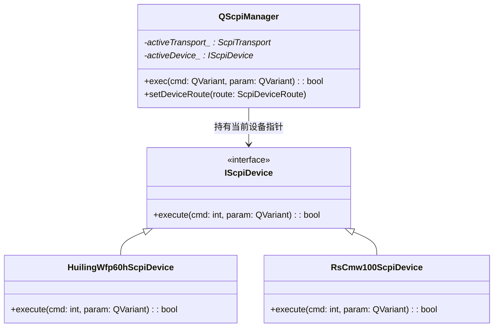

# agreement 协议层重构优化建议与架构方案

本文件针对 docs 目录下的现有重构方案（v2.1）和分层规范（v1.4）进行深入评估，并结合**自由风格工站（QFreeWork）**的运行逻辑，提出针对性的统一接口封装与优化建议。

---

## 1. 核心评估与对标

docs 目录下现有的分层方案（一外设一模块、驱动与协议分离、管理器按域拆分）非常清晰，避免了全仓大一统带来的“过度设计”和“过度抽象”问题。

但在**接口统一**和**自由工站（QFreeWork）灵活调用**方面，仍存在以下可以优化和改进的痛点：

| 痛点场景 | 现有方案设计 | 潜在风险与痛点 | 优化方向 |
| :--- | :--- | :--- | :--- |
| **新增外设命令** | 在 Manager 中为每种设备新增 `exec(XxxScpiCmd)` 或 `exec(XxxModbusCmd)` 重载。 | 违背**开闭原则（OCP）**。每新增一个设备或命令，都需要修改 Manager 头文件和实现，导致 Manager 频繁重构和重编。 | **泛型命令路由**：使用统一的 `exec` 接口，结合 Qt 的 QVariant 或模板进行多态分发。 |
| **自由工站调用** | 必须在 `qfreework_case_hooks.cpp` 中硬编码 C++ Hook（如 `JIG_CURRENT_READ`）。 | 自由风格工站（FreeWork）的“免代码配置化”大打折扣，每添加一个仪器步骤都需要写 C++ 代码。 | **通道集成（Channel Integration）**：在用例执行器中直接支持 `Modbus` 和 `Scpi` 通道，直接通过 INI 文件配置。 |
| **测量数据上报** | 物理上使用 `ammeterReadingReceived` 信号，局限于“电流表”。 | 无法优雅支持多通道电压、功率、温度等其他传感器度量。 | **统一测量数据结构**：引入 `ProtocolMeasureData` 代替局限的 ammeter 数据结构。 |
| **串口样板代码** | `test_base` 内针对 Dongle/Usb/Jig/Product 四路串口各写了一套打开、关闭、错误处理的槽函数。 | 重复代码多达数百行，维护困难。 | **连接控制器封装**：封装 `SerialChannelController` 统一处理串口与 UI 组件的绑定。 |

---

## 2. 优化方案详解

### 建议 2.1: 泛型命令路由设计（解决 Manager 膨胀与 OCP 违背）

#### 现状问题
目前 `QScpiManager` 通过显式重载支持不同设备指令：
```cpp
bool exec(HuilingScpiCmd cmd, const QVariant& param = {}, QString* errorMessage = nullptr);
bool exec(CmwScpiCmd cmd, const QVariant& param = {}, QString* errorMessage = nullptr);
```

#### 优化设计
使用 **统一多态接口 + QVariant 动态枚举包装**，使 Manager 逻辑与具体设备指令集解耦。



1. **提取设备虚基类接口**：
   ```cpp
   // agreement/scpi/access/iscpi_device.h
   class IScpiDevice {
   public:
       virtual ~IScpiDevice() = default;
       virtual bool execute(int cmd, const QVariant& param, QString* errorMessage) = 0;
   };
   ```

2. **设备类实现该接口**：
   ```cpp
   // agreement/scpi/device/huiling_wfp60h_scpi/huiling_wfp60h_scpi_device.h
   class HuilingWfp60hScpiDevice : public QObject, public IScpiDevice {
       Q_OBJECT
   public:
       bool execute(int cmd, const QVariant& param, QString* errorMessage) override {
           auto huilingCmd = static_cast<HuilingScpiCmd>(cmd);
           // 内部既有 set/get 路由分发...
           return true;
       }
   };
   ```

3. **Manager 提供模板或泛型方法，对外维持类型安全**：
   ```cpp
   // agreement/scpi/manager/qscpimanager.h
   class QScpiManager : public QObject {
       Q_OBJECT
   public:
       // 泛型执行入口，工站可直接传入具体设备的枚举
       template <typename CmdType>
       bool exec(CmdType cmd, const QVariant& param = {}, QString* errorMessage = nullptr) {
           if (!activeDevice_) {
               if (errorMessage) *errorMessage = "No active device routed";
               return false;
           }
           return activeDevice_->execute(static_cast<int>(cmd), param, errorMessage);
       }
   private:
       IScpiDevice* activeDevice_ = nullptr;
   };
   ```
   **优势**：
   - 新增 SCPI 设备时，Manager 的头文件和 `.cpp` **完全不需要修改**，只需在路由切换时 `new` 出对应的设备实例赋给 `activeDevice_` 即可。
   - 工站层调用方式保持不变，依旧可以类型安全地调用：`scpiManager->exec(HuilingScpiCmd::ReadMeasureCurrent)`。

---

### 建议 2.2: 自由工站免代码直接支持 Modbus 与 SCPI 通道

#### 现状问题
在 `qfreework_test_case.cpp` 的 `TestCaseRunner::beginStep` 中，只有 `Product`、`Dongle`、`Cloud`、`ProductSerial`、`Fixture` 通道。
PLC 和仪器的操作，都必须裹在 C++ Hook 里面，导致用户无法通过纯用例配置文件（INI）直接拉起仪表。

#### 优化设计
1. **扩展通道枚举** `TestCaseSendChannel`（在 `test_case_types.h` 中）：
   ```cpp
   enum class TestCaseSendChannel {
       Product,
       ProductSerial,
       Dongle,
       Cloud,
       Fixture,
       Modbus, // 新增：Modbus 链路
       Scpi    // 新增：SCPI 链路
   };
   ```

2. **在用例解析层支持 Modbus/SCPI 配置解析**：
   在 `platform/test_case/test_case.cpp` 中，使 `TestCaseStore` 能够读取 `Send/Device` 路由和 `Send/DeviceCmd`：
   - 对于 `Modbus`：支持配置 `Send/Device=InovanceH5uTcp` / `Send/DeviceCmd=WriteCoil`，并利用 `ModbusCmdManifest` 校验。
   - 对于 `Scpi`：支持配置 `Send/Device=HuilingWfp60h` / `Send/DeviceCmd=ReadMeasureCurrent`。

3. **在 `TestCaseRunner::beginStep` 中直接分发执行**：
   ```cpp
   // work_station/freework/qfreework_test_case.cpp
   if (def.send.channel == TestCaseSendChannel::Modbus) {
       ModbusDeviceRoute route = ModbusPeriphCmdCatalog::deviceFromIni(def.send.deviceCmd); // 或者是专用路由键
       ctx->modbusManager.setDeviceRoute(route);
       // 自动执行对应的命令
       const auto sendFn = [ctx, def]() {
           QString err;
           // 传入参数并执行
           ctx->modbusManager.exec(...); 
       };
       ctx->sendCommandWithRetry(sendFn, TestCaseRunner::commandTimeoutMs(def));
       return;
   }
   
   if (def.send.channel == TestCaseSendChannel::Scpi) {
       // 同理路由至 ctx->scpiManager() 并执行对应命令
       return;
   }
   ```

4. **用例 INI 配置示例（免 C++ 代码直接读电流并卡控）**：
   ```ini
   [Step_01]
   Name = 读取静态电流
   Send/Channel = Scpi
   Send/Device = HuilingWfp60h
   Send/DeviceCmd = ReadMeasureCurrent
   Send/Action = Get
   TimeoutMs = 1500
   Gate/Enabled = true
   Gate/Count = 1
   Gate/1/Field = value
   Gate/1/Operator = Between
   Gate/1/Expected = 10,50
   ```
   **优势**：
   - 彻底解放自由工站，现场部署人员可以直接通过修改 INI 配置，调用电流表、程控电源、PLC 气缸，无需研发人员频繁编译 C++ 版本。

---

### 建议 2.3: 统一仪器测量数据流（消除 Ammeter 的局限命名）

#### 现状问题
SCPI 协议层或 Modbus 接收到电流后，直接向外发射了带有 `Ammeter` 或 `AmmeterReading` 字样的信号：
- `rtuAmmeterReadingReceived`
- `ammeterReadingReceived`
- `ProtocolAmmeterReadingData`
这导致后面如果引入功率计、温度传感器等设备时，数据流很难复用。

#### 优化设计
1. **在 `qprotocol_types.h` 中引入通用的测量数据结构体**：
   ```cpp
   struct ProtocolMeasureData {
       QString deviceName;  // 设备名称，如 "huiling_wfp60h"
       QString channel;     // 通道号（如有，如 "CH1", "CH2"）
       QString type;        // 测量类型：Current(电流), Voltage(电压), Power(功率), Temp(温度)
       double value = 0.0;  // 测量数值
       QString unit;        // 单位，如 "mA", "V", "W"
       bool isOk = true;    // 状态是否有效
   };
   Q_DECLARE_METATYPE(ProtocolMeasureData)
   ```

2. **Manager 统一转发该结构信号**：
   所有仪表底层的回包解析（不管是 Modbus 寄存器读回，还是 SCPI 的 `MEASURE:CURR?` 回应），在解析成具体数值后，统一转化为 `ProtocolMeasureData` 并抛出信号：
   ```cpp
   emit measurementReceived(const ProtocolMeasureData& data);
   ```

3. **在 `test_base::signalAndslot` 中统一流向**：
   `test_base` 接收到 `measurementReceived` 信号后，分发给 `onUsbInstrumentReport` 或 `onJigInstrumentReport`。
   在卡控层 `GateRegistry` 中，直接针对 `ProtocolMeasureData` 属性（如 `value`）做通用阈值判定。

---

### 建议 2.4: 串口连接管理器（SerialConnectionManager）设计

#### 现状问题
`test_base.h`/`.cpp` 中存在 4 组完全雷同的串口打开/关闭/异常处理函数：
- `openDongleSerialPort` / `closeDongleSerialPort` / `handleDongleSerialPortError`
- `openUsbSerialPort` / `closeUsbSerialPort` / `handleUsbSerialPortError`
- `openJigSerialPort` / `closeJigSerialPort` / `handleJigSerialPortError`
- `openProductSerialPort` / `closeProductSerialPort` / `handleProductSerialPortError`
不仅占用了 400+ 行代码空间，且如果在打开串口时需要加入连接重试、自动重连等优化逻辑，需要在 4 处分别修改。

#### 优化设计
封装一个轻量级的 **`SerialPortController`**：

```cpp
// common/serial_port_controller.h
class SerialPortController : public QObject {
    Q_OBJECT
public:
    struct UIControls {
        QComboBox* portCombo = nullptr;
        QPushButton* connectButton = nullptr;
        QPushButton* disconnectButton = nullptr;
        QLabel* statusLabel = nullptr;
    };

    SerialPortController(SerialChannel* channel, const UIControls& ui, QObject* parent = nullptr);

    bool open();
    void close();
    void setBaudRate(int baud);
    void setReadDebounceMs(int ms);
    void setRtsDtrMode(SerialChannel::RtsDtrMode mode);

signals:
    void stateChanged(bool isOpen);

private:
    void handleError(QSerialPort::SerialPortError error, const QString& message);

    SerialChannel* channel_ = nullptr;
    UIControls ui_;
    int baudRate_ = 115200;
    int debounceMs_ = 10;
    SerialChannel::RtsDtrMode rtsDtrMode_ = SerialChannel::RtsDtrMode::Enable;
};
```

**改造后的 `test_base` 缩影**：
```cpp
// test_base.h
std::unique_ptr<SerialPortController> dongleController_;
std::unique_ptr<SerialPortController> usbController_;
std::unique_ptr<SerialPortController> jigController_;
std::unique_ptr<SerialPortController> productController_;

// test_base.cpp 构造函数中一行绑定：
SerialPortController::UIControls dongleUI{ getComNameCombo(), getConnectButton(), getDisconnectButton(), getDongleStatusLabel() };
dongleController_ = std::make_unique<SerialPortController>(dongleSerialChannel_, dongleUI, this);
```
**优势**：
- 删除了大量的重复槽函数。
- 串口行为（如权限报错、拔掉 USB 掉线检测、自动重连）可以在 `SerialPortController` 中统一收拢实现，极大提升了底层通讯的稳定性。

---

## 3. 方案的进一步审视与深度优化补充

在上述核心优化的基础上，为确保重构方案在“健壮性”和“生产部署”层面达到工程化标准，建议补充以下进阶优化设计：

### 补充 3.1: 异步回调上下文绑定 (Context Binding)
- **现状缺陷**：如果自由工站通过 INI 直接下发仪器指令，SCPI 或 Modbus 的收包过程常常是异步的。工站发出请求后，如果在等待期收到测量结果，Manager 直接抛出信号。此时系统如何精准地将返回数据关联到当前正在执行的 `TestCaseDefinition` 步骤？
- **优化建议**：
  在 `QFreeWork` 中必须维护一个“当前挂起的异步指令及预期上下文”（可以挂载在 `stepRuntime_` 内，并生成唯一的 RequestID 或 Token）。或者，在设备的 `exec` 接口中引入 `std::function` 回调和 `Promise` 机制，以此实现上下文的自动闭环，确保在高并发或重试逻辑下回包不会被错误归属。

### 补充 3.2: 参数校验层与类型安全 (Parameter Schema Validator)
- **现状缺陷**：在泛型路由方案中，使用 `QVariant` 进行命令转换非常灵活，但如果不对输入进行严格的合法性校验，一旦测试人员在 INI 中配错了参数类型（例如将布尔值错写成了字符串），可能会导致底层的运行时异常甚至崩溃。
- **优化建议**：
  应充分依托现有的 Manifest 系统（`modbus_cmd_manifest` / `device_cmd_manifest`），在 Manifest 的 `Row` 结构中强化并启用 `DeviceCmdParamSchema` 验证功能。在 Manager 实际分发给具体设备执行之前，或者在配置解析阶段，强制依据 Schema 对 INI 参数格式进行拦截校验，做到**错误前置暴露**。

### 补充 3.3: 执行模型的统一（全面异步化与状态机统筹）
- **现状缺陷**：当前 SCPI 设备连接可能存在不同路径：例如串口是基于 `readyRead` 异步回调的，而通过 VISA （例如网口/ GPIB 等）进行查询往往会发生同步阻塞。若自由工站通过同一套 `exec` 来驱动，这种底层同步/异步的不一致性极易导致开发调试上的困惑，甚至在执行耗时的 VISA 读操作时造成 UI 线程轻微卡顿。
- **优化建议**：
  强烈建议规范并统一 `IScpiDevice::execute` 及其派生类的执行模型。推荐**全面拥抱异步模型**：不论底层驱动是 VISA 还是普通串口，`execute` 均立即返回；对于所有需要查询的操作，最终结果统一经过 `measurementReceived` 这类信号（或预绑定的 Promise）向外发射。这能使工站层的 `sendCommandWithRetry` 机制完美兼容任何一种设备。

### 补充 3.4: 统一状态观测接口 (Unified State Reporting)
- **现状缺陷**：诸如“串口已连接”、“蓝牙断开”这类状态变更，目前散落在 `test_base` 的各路槽函数中进行处理，并通过直接操纵 UI 控件（如 `ui->bleStatusLabel->setText(...)`）来提示用户，导致业务层与传输层耦合严重。
- **优化建议**：
  引入一个轻量级的 `TransportStatusObserver` 接口机制。所有的 Manager（以及前文建议封装的 `SerialPortController`）统一通过这一观察者接口上报 `Connected` / `Disconnected` / `Error` 状态。`QFreeWork` 只需监听此状态流，就能实现界面同步刷新和对所有仪器的全盘断线保护，代码整洁度会大幅提升。

---

## 4. 补充后的后续阶段规划 (修订版)

结合原来的分层规划（v1.4），建议在第 4 阶段后补充以下阶段以收拢工程质量：

| 阶段 | 内容 | 目标 |
| :--- | :--- | :--- |
| **1~4** | 抽象接口、去 Ammeter 命名、免代码调用、串口控制器重构 | 见《重构落地路线建议》。 |
| **5** | **上下文绑定器 (Context Binder)** | 建立仪器异步命令到 `TestCaseDefinition` 的自动映射，解决异步回调难以归位的问题。 |
| **6** | **配置参数格式校验 (Schema Validator)** | 在读取 INI 参数时，依据 Manifest 定义自动校验类型，避免运行期类型崩溃。 |
| **7** | **统一状态机 (Unified State Reporting)** | 传输层状态变更的标准化流转，接管所有连接与掉线反馈。 |
