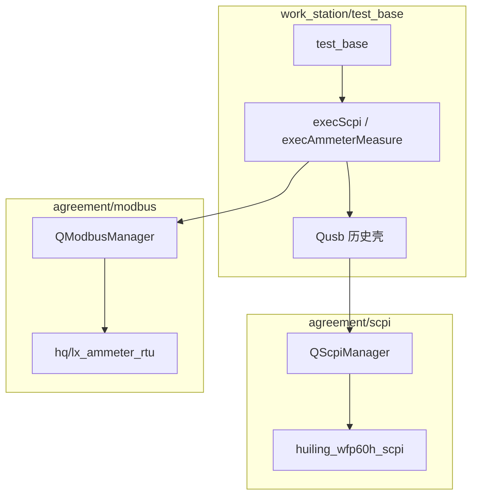

# agreement 按外设域拆分重构方案（v2）

> 替代「全仓统一 codec/access/manager/device」的大一统思路。  
> **结论**：产测协议、Modbus、USB 电流表、VISA/CMW、治具串口、产品串口等**业务差异大**，不宜强行塞进同一套虚基类；应 **一外设一模块**，仅在**同一域内**复用「驱动 → 协议字符 → 访问 → 管理」分层。  
> 长期痛点：**`qusb`** 混杂多种协议（留待**最后阶段**再拆）。  
> **落地顺序**：**先做产测协议域**（`qProtocol` → `factory_protocol`），再 Modbus / 治具 / VISA，**最后拆 qusb**。

---

## 1. 设计原则

| 原则 | 说明 |
|------|------|
| **一外设一模块** | 一个物理外设或一条业务链路对应一个目录/门面类；功能相近再抽公共 **驱动** 或 **codec**，不跨域硬统一。 |
| **驱动与协议分离** | **驱动**只负责字节收发（串口/VISA/TCP）；**协议字符层**只组帧/解帧；**设备模块**绑驱动并暴露 `set/get/parseCmd`。 |
| **管理器按域拆分** | `QProtocolManager` 只管 **dongle 产测协议**；`QModbusManager` 只管 **Modbus**；**不要**用同一个 Manager 切换 PLC 与 USB 电流表。 |
| **业务与协议分离** | **`agreement/`** 仅通讯协议通用封装（`factory_protocol`、`modbus`、`qusb`…）；**`business/`**（仓库根）放工站业务步骤（PLC 治具、三元组、OTA）。 |
| **渐进迁移** | **阶段 1 产测协议** → Modbus / 外设域 → **最后 qusb**；每步可编译、可回滚。 |

### 1.1 分层含义（按域选用，非每层都必须）

```text
工站 test_base / 各工站
        │
        ▼
┌─────────────────── 管理协议层 ───────────────────┐  工站唯一入口（可选）
│  QProtocolManager / QModbusManager / Qusb（COM 电流表）        │
└────────────────────────┬─────────────────────────┘
                         ▼
┌─────────────────── 访问层 ─────────────────────────┐  统一 Cmd 枚举、set/get 签名
│  DeviceCmd / PlcCmd / UsbCmd / VisaCmd …          │
└────────────────────────┬─────────────────────────┘
                         ▼
┌─────────────────── 协议层（字符/功能）─────────────┐  组帧、解析、步骤语义
│  SCPI 行 / Modbus PDU / FCTP 帧 / 治具 UART 帧 …   │
└────────────────────────┬─────────────────────────┘
                         ▼
┌─────────────────── 驱动层（platform）─────────────┐  可复用 I/O
│  SerialChannel / VisaSession / TcpChannel         │
└───────────────────────────────────────────────────┘
```

**协议虚函数层**（`qProtocol` 及 `DeviceCmd`）**仅用于 dongle 产测多协议切换**（qpb / qfctp / qaiot / qroot），不强迫 VISA、治具、电流表继承同一基类。

---

## 2. 目标目录总览

```text
platform/
└── driver/                          # 从 platform/serial 等迁入，纯 I/O
    ├── serial/                      # SerialChannel（现 platform/serial）
    ├── visa/                        # VISA 打开/读写/查询（现 qvisa 底层会话）
    └── tcp/                         # QTcpSocket：主机+端口、超时、粘包缓冲

business/                            # 【工站业务封装】不在 agreement 下
├── plc_v3_fixture/                  # V3 治具 PLC（PlcV3Facade）
├── tuple/                           # QTupleService
└── ble_ota/                         # RootBleOtaClient

agreement/                           # 【通讯协议通用封装】
├── qbulk/                           # 【服务】真 USB Bulk，路径不动
├── qadb/                            # 【服务】ADB，路径不动
├── qshell/                          # 【服务】Shell 进程，路径不动
├── qmes/                            # 【工具】各工厂 MES（可后续迁入根目录 business/）
│
├── factory_protocol/                # 【域 A】dongle 产测协议（仅 qpb/qfctp/qaiot/qroot）
│   ├── access/                      # qprotocol.h、qprotocol_types.h（DeviceCmd）
│   ├── manager/                     # QProtocolManager
│   ├── codec/                       # FCTP 帧、nanopb 运行时（可选子目录）
│   └── protocol/                    # qpb、qfctp、qaiot、qroot
│
├── modbus/                          # 【域 B】Modbus：通用协议 + 设备子目录
│   ├── codec/                       # qmodbus_pdu（PDU/CRC）
│   ├── rtu/                         # RTU 帧（485/COM）
│   ├── access/                      # modbus_types（链路级通用）
│   ├── manager/                     # QModbusManager
│   └── device/                      # 仅 **Modbus** 设备（TCP/RTU）
│       └── inovance_h5u_tcp/        # 汇川 H5U Modbus TCP
│       # RTU 电流表：<厂商>_<型号>_rtu（拆 qusb 后）
│
├── scpi/
│   ├── access/scpi_types.h        # ScpiDeviceRoute（无跨设备 Cmd）
│   ├── codec/scpi_line_codec
│   ├── manager/qscpimanager       # exec(HuilingScpiCmd) / exec(CmwScpiCmd)
│   ├── manager/qscpivisasession   # VISA SCPI
│   └── device/
│       ├── huiling_wfp60h_scpi    # HuilingScpiCmd
│       └── rs_cmw100_scpi         # CmwScpiCmd
│
├── peripheral_protocol/             # 【域 C】外设 RS232/COM **自定义**协议（非 Modbus/SCPI/产测）
│   ├── codec/                       # 粘包、定长帧、物理层解析（可复用）
│   └── device/<厂商>_<型号>_<帧型>/  # 组帧/解帧（厂商私有命令表）
│
├── product_serial/                  # 【域 D】产品串口（**独立域，不得迁入 peripheral_protocol**）
│   └── protocol/                    # qproduct：校频、开始/停止接收、PER 等
│
├── fixture/                         # 【域 F】治具
│   ├── jig/                         # qjig：气缸/继电器，无 UI
│   ├── codec/                       # fixture_*_uart_protocol（PCBA/压感/IMU/相机）
│   └── uart_ui/                     # fixture_uart（带 UI 的调试窗）
│
└── dongle_at/                       # 【域 G】dongle AT
    └── qat/
```

---

## 3. 各域说明

### 3.1 platform/driver（驱动层）

| 驱动 | 现状 | 目标 |
|------|------|------|
| **串口** | `platform/serial/serial_channel` | 迁到 `platform/driver/serial/`；`qat`、`qjig`、`fixture`、`QSerialAmmeterManager` 统一 `write` |
| **VISA** | ~~`agreement/qvisa`~~ | **已完成**：`platform/driver/visa` 字节 I/O；SCPI 在 `agreement/scpi/manager/qscpivisasession` |
| **TCP** | PLC、三元组各自 `QTcpSocket` | **driver/tcp**：`connect(host,port)`、发送、收包回调；MES HTTP 仍可用 QNetwork，或另建 `driver/http` |

驱动层 **禁止** 出现 `DeviceCmd`、工站名、卡控阈值。

---

### 3.2 业务封装层 `business/`（仓库根，不在 agreement 下）

> **`agreement/` = 通讯协议通用封装**；**`business/` = 工站可直接调用的业务步骤类**（可依赖 agreement 里的驱动/协议）。

工站**直接调用**的会话/步骤类，与通用协议栈分离：

| 目录 | 说明 | 工站用法 |
|------|------|----------|
| `plc_v3_fixture/` | V3 治具 PLC 整步（连接测试、按键、旋钮） | 自由工站 `plcFacade_.run(PlcV3Command, params)` |
| `cmw_gprf/` | CMW100 GPRF PER/burst | `CmwGprfFacade::run` + `scpiVisaManager()` |
| `tuple/` | 三元组 TCP/HTTPS | `QTupleService` |
| `ble_ota/` | 路特 BLE 资源 OTA | `RootBleOtaClient` + 发送回调 |

**原则**：`modbus/` 只提供 **PlcCmd + QModbusManager + H5U 驱动**；`PlcV3Fixture` 等业务类**不得**放在 `modbus/device/`。

仍留在 `agreement/q*` 的工具类：`qbulk`、`qadb`、`qshell`、`qmes`（可逐步迁入根目录 `business/`）。

### 3.2.1 与产测 / 服务工具边界

| 目录 | 说明 |
|------|------|
| `factory_protocol` | dongle 产测 `DeviceCmd` / `protocolManager` |
| 根目录 `business/*` | 工站业务步骤（PLC 治具、三元组、OTA） |
| `qbulk` / `qadb` / `qshell` | 真 USB Bulk、ADB、Shell 进程 |
| `qmes` | 各厂 MES HTTP |

**勿混淆**：`qpb/ble_protocol` 是产测 PB 定义；`business/ble_ota` 是 OTA 会话。

---

### 3.3 modbus 域（通用协议 + 设备封装）

#### 分层与边界

| 层 | 路径 | 职责 | 禁止 |
|----|------|------|------|
| codec | `modbus/codec/` | `qmodbus_pdu`（PDU/CRC）；`qmodbus_rtu_codec`、`qmodbus_rtu_rx_buffer`（RTU 帧/粘包） | 设备地址、工位 M 偏移、SETTINGS 路由 |
| tcp | `modbus/tcp/`（待建） | TCP MBAP 收发（通用） | 治具语义 |
| access | `modbus/access/modbus_types` | 链路级类型、`ModbusRtuRoute` | 具体设备组帧 |
| manager | `modbus/manager/qmodbusmanager` | **唯一入口**：`exec(PlcCmd)`、`exec(ModbusRtuAmmeterCmd)`、`withSession` | 自行组 PDU/CRC |
| **device** | `modbus/device/<前缀>_<型号>_{tcp\|rtu}/` | **仅 Modbus 设备**（PLC、RTU 电流表） | 放 SCPI 设备 |

**`modbus/device/` 只收 Modbus 链路设备**；SCPI 设备（如会凌 WFP60H）放在 **`scpi/device/`**，不得因历史 `qusb` 混放而放进 modbus。

**device 子目录命名（优先真实品牌，其次制造厂商）**：

命名格式仍为：`<前缀>_<model>[_<transport>]`（全小写、下划线）。

| 优先级 | 前缀取什么 | 何时用 | 示例 |
|--------|------------|--------|------|
| **1（优先）** | **真实品牌**（铭牌、包装、`*IDN?` 中的 Brand） | 能查到或实机可读 | `inovance_h5u_tcp`（modbus）、`huiling_wfp60h_scpi`（scpi） |
| **2（次选）** | **制造厂商**（手册/采购单/`*IDN?` 的 Manufacturer，无独立品牌时） | 无铭牌品牌、仅有生产商信息 | `gw_instek_gpm8213_rtu`（示例） |
| **禁止** | 产线/MES 代号、功能泛称 | — | 勿用 `hq`、`luxshare`、`plc`、`ammeter` 作目录前缀 |

说明：

- **品牌**与**制造厂商**在多数 PLC/仪表上相同（如汇川 → `inovance_h5u`）；电流表若 OEM 无子品牌，用次选厂商名即可。
- `Mes/FACTORY`、`Qusb::ProtocolType` 的 `hq`/`lx` 等：**仅 manager 路由与 SETTINGS**，不直接当 device 目录名；路由配置里映射到上表某一 `device/<前缀>_<model>/`。
- 同一厂商多台型号：必须带 **model** 区分；同型号多链路加 `_tcp` / `_rtu` / `_scpi`。

| 现状 / 代码习惯 | 目标 device 目录 | 备注 |
|----------------|------------------|------|
| `device/inovance_h5u_tcp/` | **`modbus/device/inovance_h5u_tcp/`** | Modbus TCP（已从 plc_h5u_tcp 重命名） |
| `Qusb` SCPI / WFP60H | **`scpi/device/huiling_wfp60h_scpi/`** | 会凌 HUILING，型号 WFP60H；**不是 modbus** |
| `HqModbus` / `LxModbus`（qusb） | **`modbus/device/<前缀>_<型号>_rtu/`** | Modbus RTU 电流表 |

工站按产线切换协议时，在 **manager** 里选对应 device 实例（配置仍可写 `Current/ProtocolType=hq`），**目录名遵循上表，与产线代号脱钩**。

同一 manager（如 `QSerialAmmeterManager`）可绑定多个 device 实现切换；**每个品牌型号仍独立目录**，不得在单目录里堆 `switch(工厂)` 协议解析。

**device 目录约定（`inovance_h5u_tcp` 已落地；SCPI 行缓冲已抽至 `scpi/codec`）**：

1. **只使用 codec/device**：组帧、CRC、RTU 粘包必须走 `modbus/codec`；**不得在 device 内再抄一份 PDU 状态机**。
2. **device 只写「这台设备」**：`inovance_h5u_tcp.h/.cpp`（TCP、PlcCmd、会话、工位配置合一）。
3. **工站不直接 new device 类**：经 `QModbusManager`（或该设备 manager）访问。
4. **业务整步不进 device**：V3 治具流程在 `business/plc_v3_fixture`，device 只做线圈级能力。

示例（PLC）：

```text
QModbusManager → PlcModbusSession → InovanceH5uModbusTcp
                      ↓
              QModbusPdu::buildReadCoils… / parseReadCoilsPdu   ← 必须用 codec
              （TCP MBAP 暂在 inovance_h5u_tcp，后续可迁 modbus/tcp）
```

| 场景 | 调用 |
|------|------|
| 按键工站散线圈读写 | `test_base::modbusManager.exec(PlcCmd::ReadCoil/WriteCoil/…)` |
| 自由工站 V3 整步 | `plcFacade_.setModbusManager(&modbusManager)` → `plcFacade_.run()` |
| 串口电流 RTU | `modbusManager.exec(ModbusRtuAmmeterCmd)` → **device/hq|lx_ammeter_rtu**（产线 hq/lx 仅 manager 路由） |

---

### 3.4 串口电流表设备（重点拆 qusb）

> **命名**：`Qusb` 为历史名（实为 COM 串口）。拆后 **每种表一个 `device/<品牌>_<型号>/`**，不用泛名 `serial_ammeter` 单目录；协议仍在 `scpi/`、`modbus/rtu/`。

#### 现状问题（`agreement/qusb/qusb.*`）

- 继承 `QSerialPort`，同时承担：协议路由、SCPI 行缓冲、Modbus RTU 组帧/解析、程控电源、吸力旧指令、`UsbCmd` / `PowerAction` 两套 API。
- `resolveProtocolForInput/Output` 隐式规则多，新增仪表型号只能继续堆 `switch`。
- 与 Modbus codec 部分重复（`processModbusRTUData` vs `qmodbus_pdu`）。

#### 目标拆分

```text
agreement/scpi/
├── codec/scpi_line_codec            # 行缓冲
├── manager/qscpiserialsession       # 仅传输会话（writeLine / feedRx）
├── manager/qscpimanager             # ScpiDeviceRoute + exec(ScpiCmd)
└── device/huiling_wfp60h_scpi/      # profile + device

agreement/modbus/codec/qmodbus_rtu_* # RTU 粘包（PDU 用 modbus/codec）
modbus/device/<前缀>_<型号>_rtu/     # Modbus RTU 电流表（非 SCPI）

serial_ammeter/manager/              # 工站入口；COM 上路由到 scpi/device 或 modbus/device
```

分层细则见 [agreement协议目录分层规范.md](./agreement协议目录分层规范.md) §4。

**门面职责**（约 100 行级）：

1. 持有 `SerialChannel*`（不再继承 `QSerialPort`）。
2. `parseCmd(byte)` → 按当前 `ProtocolType` 转给对应后端 `parse`。
3. `set/get(UsbCmd)` / `sendPowerInstruction` → 路由到 scpi / hq / lx。
4. 统一 `emit reportReceived(ProtocolAmmeterReadingData)`。

**三套协议文件各管**：

| 设备 profile 文件 | 模式 | 功能 |
|------|------|------|
| `huiling_wfp60h_scpi` | SCPI | **`scpi/device/`** 会凌 WFP60H |
| `<前缀>_<型号>_rtu` | Modbus RTU | **`modbus/device/`** 电流表 |

组帧/CRC **统一调用** `modbus/codec/qmodbus_pdu`，不在 qusb 内复制 `kReg0HighIndex` 等常量。

---

### 3.5 VISA / SCPI（已并入 scpi 域 + business）

| 层 | 内容 |
|----|------|
| 驱动 | `platform/driver/visa`：`viWrite` / `viRead` |
| 协议 | `agreement/scpi/`：`QScpiVisaSession` + `device/huiling_wfp60h_scpi`（`HuilingScpiCmd`）、`device/rs_cmw100_scpi`（`CmwScpiCmd`） |
| 工站 | `test_base::scpiVisaManager_`（VISA 实例，与 USB 串口 `Qusb::scpiManager()` **分离**） |
| 业务 | `business/cmw_gprf/CmwGprfFacade`：GPRF ARB、切频、burst；trace 读 `BlePer/CmwVisaTrace` |

**已删除**：`agreement/qvisa/`、`agreement/visa_instrument/`。自由工站并联 CMW 与产品串口 PER **并行**，不走 `QProtocolManager`。

---

### 3.6 peripheral_protocol 域（外设 RS232 自定义协议）

| 内容 | 说明 |
|------|------|
| **统一命名** | 走 **COM/RS232** 接**外设**、且**非** Modbus / SCPI / dongle 产测的**自定义帧**，目录统称 **`peripheral_protocol/`** |
| **与 product_serial 分界** | **`product_serial/` 不动**：产品侧串口（`qproduct`、校频、PER、仪器 ACK）仍独立；**不得**把 `qproduct` 迁入本域 |
| **与 modbus/scpi 分界** | Modbus RTU/TCP → `modbus/`；SCPI 行协议 → `scpi/`；本域只收**厂商私有/定长**等非标准帧 |
| **device 命名** | `<厂商>_<型号>_<帧型或链路特征>`（协议特征放段末，与 `inovance_h5u_tcp`、`*_rtu` 同理） |
| **现状** | 治具 UART 帧暂留 `fixture/codec/fixture_*_uart_protocol`；后续 `git mv` 至本域 `codec/` 或 `device/` |
| **不含** | SCPI / Modbus RTU 电流表（分别在 `scpi/`、`modbus/` + `serial_ammeter/manager` 路由） |

---

### 3.7 product_serial 域

| 内容 | 说明 |
|------|------|
| `qproduct` | 产品串口：开始/停止接收、校频命令、仪器 ACK |
| **路径冻结** | 保持 `agreement/product_serial/protocol/`，**不**改名为 `peripheral_protocol` |
| 与 factory_protocol **分离** | dongle 走 `QProtocolManager`；产品 COM 走 `product->writeRaw` / 专用步骤 |

可选子目录：

- `calibration/` — 校频相关命令字  
- `ble_rx/` — 多 profile 接收（2402/2440/2480 × 1M/2M）

---

### 3.8 factory_protocol 域（产测 FCTP/PB/…）

四层职责与调用链详见 **[factory_protocol产测协议四层架构.md](./factory_protocol产测协议四层架构.md)**。

保持现有 **`qProtocol` 虚函数 + `QProtocolManager`** 思路，仅整理目录：

```text
factory_protocol/
├── access/          qprotocol.h, qprotocol_types.h
├── manager/         qprotocolmanager.*
├── codec/
│   ├── fctp/        comm_protocol_*
│   └── nanopb/      pb_*.c（或暂留 qpb 旁）
└── protocol/
    ├── qpb/
    ├── qfctp/
    ├── qaiot/
    └── qroot/
```

> **不含** OTA/三元组/PLC 业务：见根目录 `business/` §3.2。

工站：`protocolManager.set/get(DeviceCmd)`，`SYSTEM/ProtocolType` 切换实现类。

---

### 3.9 fixture 域

| 模块 | 说明 |
|------|------|
| `jig/` | `qjig`：气缸、继电器，**无 UI** |
| `codec/` | `fixture_pcba_uart_protocol` 等（**RS232 自定义帧**，后续迁入 `peripheral_protocol/`） |
| `uart_ui/` | `fixture_uart`：菜单「连接治具串口」、多协议 RX 状态机 |

治具与 jig **不合并**；共享 `SerialChannel`；帧协议归属 **`peripheral_protocol`** 命名空间，与 **`product_serial` 无关**。

---

## 4. 与旧版「agreement 分层重构」的差异

| 旧方案问题 | v2 调整 |
|------------|---------|
| 所有设备共 `device/peripheral` | 按 **协议目录 + 设备目录** 分：`modbus/`、`scpi/`、**`peripheral_protocol/`**（外设自定义帧）；**`product_serial/` 独立不动** |
| `QModbusManager.useBackend(UsbRtu)` 切电流表 | 电流表归 **serial_ammeter** + **modbus/rtu**；Manager 只管 PLC TCP |
| `qusb` 单文件 500+ 行 | 门面 + 3～4 个协议实现文件 |
| codec/access/manager 全仓 mandatory | **仅产测、Modbus 等需要切换的域** 建 manager |
| 一次 `git mv` 全仓 | **先 factory_protocol，再 modbus/外设，最后 qusb** |

---

## 5. 迁移阶段（执行顺序）

### 阶段 0：文档与约定

- 以本文为准；旧「全仓大一统分层」方案不再执行。

### 阶段 1：产测协议域 `factory_protocol`（**最先做**，**已落地 1a～1f**）

> 当前仓库：`agreement/qProtocol/` 已迁至 `agreement/factory_protocol/`（access / manager / codec/fctp / protocol/*）。请 **重新 qmake** 后全量编译。

目标：把现有 `agreement/qProtocol/` 收成 **访问层 + 管理器 + codec + 协议实现**，工站仍只认 `protocolManager` / `DeviceCmd`。

**建议子步骤（每步单独 commit、全量编译）**：

| 子步 | 动作 | 验收 |
|------|------|------|
| 1a | `qfctp/common_protocl` → `factory_protocol/codec/fctp/` | FCTP 收发 |
| 1b | `qprotocol.h`、`qprotocol_types.h` → `factory_protocol/access/` | 头文件短名 include 仍可用 |
| 1c | `qprotocolmanager.*` → `factory_protocol/manager/` | `set/get/parseCmd`、切换 `ProtocolType` |
| 1d | `qpb`、`qfctp`、`qaiot`、`qroot` → `factory_protocol/protocol/` | 四协议冒烟；**`qroot.h` 须编入 .pro** |
| 1e | OTA/三元组/PLC 业务 → 根目录 `business/` | MainWindow OTA、自由工站 PLC 冒烟 |
| 1f | 更新 `.pro` `INCLUDEPATH`；工站 `#include` 逐步改短名 | 全工站编译通过 |

**原则**：

- **不改** `DeviceCmd` 语义与 `Protocol*Data` 信号体系（见 [协议解耦迁移说明.md](./协议解耦迁移说明.md)）。
- **不搬** `qpb/Python39`、`generator`（仍留协议目录旁）。
- `QProtocolManager::bindQroot` 等须 `#include` 完整类型头（避免仅前向声明导致 C2664）。

**必测工站**：自由工站 / 按键 / 吸力 / WiFi-BLE 等凡走 `protocolManager` 的 dongle 步骤；设置页 `SYSTEM/ProtocolType` 切换 qpb / qfctp / qaiot / qroot。

### 阶段 2：platform/driver（**2a 已落地**）

1. ~~`platform/serial` → `platform/driver/serial`~~ → **已完成**（`SerialChannel` 路径不变，短名 `#include "serial_channel.h"` 仍可用）。
2. ~~VISA 会话下沉 `platform/driver/visa`~~ → **已完成**；`qvisa` 已删除。

### 阶段 3：modbus 域收拢（**3a 已落地**）

1. ~~`qtransport/qmodbus_pdu` → `agreement/modbus/codec/`~~ → **已完成**。
2. ~~`qplc/*` → `modbus/device/inovance_h5u_tcp`~~ → **已完成**
3. 按键 PLC、自由工站 `PlcV3Fixture` 冒烟（**请本地编译验证**）。
4. ~~`modbus` 通用层 + 根目录 `business/` 拆分~~ → **已完成**：`PlcV3Fixture`/三元组/OTA 在 `business/`；`QModbusManager` 仅 H5U 线圈 `PlcCmd`。
5. **未做**：qusb 拆为按**铭牌品牌型号**的 `device/<brand>_<model>/`（阶段 6；hq/lx 不用于目录名）

### 阶段 4：fixture / product_serial / visa 归位（**4b 已全面落地**）

1. ~~`qfixture/protocol` → `fixture/codec`；`fixture_uart` → `fixture/uart_ui`；`qjig` → `fixture/jig`~~ → **进一步优化**：
   - 引入了 `QFixtureManager`（位于 `agreement/fixture/manager`），接管底层串口和拆包逻辑。
   - `fixture_uart` 纯 UI 化，移至 `platform/settings/widgets`。
   - 具体的治具协议文件（PCBA、IMU、压感、Camera 等）统一归纳至 `agreement/fixture/device/` 目录下。
2. ~~`qproduct` → `product_serial/protocol`~~ → **已完成**。
3. ~~CMW 协议 → `scpi/device/rs_cmw100_scpi`；业务 → `business/cmw_gprf`~~ → **已完成**（2026-06）。
4. ~~删除 `qvisa`、`visa_instrument`~~ → **已完成**；VISA 字节 I/O 在 `platform/driver/visa`。

> 短名 `#include "fixture_uart.h"`、`qfixturemanager.h`、`qproduct.h` 仍可用（`.pro` 已更新 `INCLUDEPATH`）。请 **重新 qmake** 后全量编译。

### 阶段 5：服务层（**默认不动**）

`business/` 已收 `plc_v3_fixture`、`tuple`、`ble_ota`；`qbulk`、`qadb`、`qshell`、`qmes` 仍 `agreement/q*`。

### 阶段 6：拆 `qusb`（**6c 已全面落地**）

1. ~~新建 `agreement/scpi/codec/scpi_line_codec`~~ → **已完成**；`qusb` 已改用 `ScpiLineCodec`。
2. ~~新建 `scpi/device/huiling_wfp60h_scpi` 命令表~~ → **已完成**。
3. ~~RTU 帧解析/粘包~~ → **已完成**（并入 `modbus/codec/qmodbus_rtu_*`）；HQ/LX 经 **同一 `QModbusManager`** 路由。
4. ~~`modbus/device/hq_ammeter_rtu`、`lx_ammeter_rtu`~~ → **已完成**（`厂商_型号_协议` 过渡目录，铭牌确认后改为 `<品牌>_<型号>_rtu`）。
5. ~~`qusb` 程控/量测 SCPI 接入 `HuilingWfp60hScpiProfile::fromSettings()`~~ → **已完成**（`mergeHuilingScpiProfile`）。
6. ~~HQ/LX RTU 并入 `QModbusManager`~~ → **已完成**；`qusb` HQ/LX 过渡委托。
7. ~~COM 电流表 + SCPI 各 device 自有 Cmd~~ → **已完成**：`HuilingScpiCmd`、`CmwScpiCmd`；无 access 层 `ScpiCmd`。
8. ~~**废弃 `agreement/qusb/`，门面并进 `test_base`**~~ → **已完成**：`Qusb` 类已删除，`test_base` 直接持有 `scpiUsbManager_` 完成 SCPI/Modbus RTU 路由。`qusb_types.h` 保留于 `agreement/qusb/` 提供枚举兼容。
9. ~~**SCPI 协议层去除 `ammeter` 命名**~~ → **已完成**：`ammeterReadingReceived` → `measureReadingReceived`；`ProtocolAmmeterReadingData` 保留兼容别名。
10. **未做**：`peripheral_protocol` 收纳治具自定义帧；modbus 独立 pro 冒烟。
11. 验收：静态电流、吸力、程控电源 SCPI；HQ/LX RTU 读电流；多 SCPI 设备路由冒烟（**请本地 qmake + 全量编译**）。

> **为何 qusb 放最后**：产测协议是先理顺的样板；qusb 虽乱但边界清晰（仅 **COM 串口电流表**），且依赖 Modbus codec，放在 modbus 域收拢之后拆更稳。

---

## 6. 工站调用对照（迁移后）

| 场景 | 调用入口 | 域 |
|------|----------|-----|
| dongle 读 SN/RSSI | `protocolManager.set/get` | factory_protocol |
| 串口读电流 | `execAmmeterMeasure()` / `execScpi(HuilingScpiCmd)` | `scpi/` + `modbus/device`（`qusb` 待删） |
| 按键 PLC | `modbusManager` + `PlcCmd` | modbus |
| 自由工站 PLC 步骤 | `plcFacade_.run`（注入 `modbusManager`） | modbus + business |
| VISA 程控电源 | `execVisaHuiling(HuilingScpiCmd)` | `scpi/` + `scpiVisaManager_` |
| 并联 CMW | `cmwFacade_.run` + `scpiVisaManager()` | `scpi/device/rs_cmw100_scpi` + `business/cmw_gprf` |
| 产品串口 PER | `product->…` / `startProductInstrument*` | product_serial |
| 治具 PCBA | `fixtureUartWidget()` / test_case Channel=Fixture | fixture |
| MES / 三元组 / BLE OTA / Bulk | `MesManager` / `QTupleService` / `RootBleOtaClient` / `Qbulk` | `qmes`；`business/tuple`、`business/ble_ota`；`qbulk` |

---

## 7. COM 电流表调用示意（现网 → 目标）

**现网**（`qusb` 待废弃）：



**目标**（阶段 6 收尾，见分层规范 §6.1）：删除 `Qusb`，`test_base` 直接持有 `QScpiManager` + `QModbusManager`。

---

## 8. 验收清单

| 阶段 | 必测 |
|------|------|
| **1 factory_protocol** | qpb / qfctp / qaiot / qroot 收发；`protocolManager` 切换；多工站 dongle 步骤 |
| 2 driver | 串口写口统一（若本阶段已改 `SerialChannel` 路径） |
| 3 modbus | 按键 PLC 线圈；自由工站 TouchKey/旋钮/连接测试 |
| 4 fixture/visa/product | PCBA 治具步骤；CMW GPRF；产品串口 PER |
| **6 qusb** | 华勤/立讯/SCPI 三路电流；程控电源；**最后验收** |

---

## 9. 相关文档

- [自由工站协议调用说明.md](./自由工站协议调用说明.md)（迁移后需同步路径）
- [factory_protocol产测协议四层架构.md](./factory_protocol产测协议四层架构.md)（虚函数 / 访问 / 管理 / 协议字符层对照）
- [Root吸奶器PCBA串口测试协议.md](./protocol/Root吸奶器PCBA串口测试协议.md)（qroot 属 factory_protocol）
- 旧版 [agreement目录分层重构方案.md](./agreement目录分层重构方案.md) — **仅供参考，不再作为执行依据**

---

*文档版本：v2.1，执行顺序：阶段 1 产测协议 → … → 阶段 6 qusb。*
