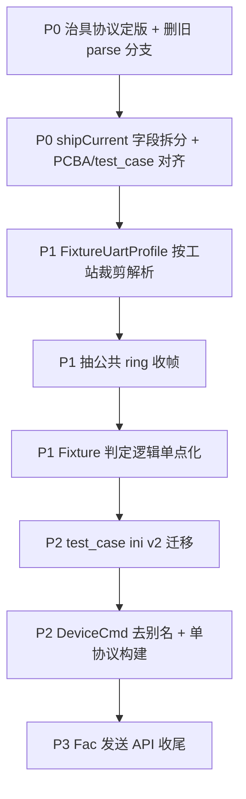

# 旧协议兼容与冗余代码梳理（Diamond 优化参考）

> 目的：标出为**兼容旧协议/旧配置/旧工站**而保留的**并行实现**，便于做 Diamond 式收敛（删旧路径、统一模型、单入口）。
>
> 梳理时间：2026-06-04（基于当前 `main` 工作区代码与近期治具/test_case 改动）。

---

## 1. 优化优先级总览

| 优先级 | 区域 | 冗余本质 | 建议收敛方向 |
|--------|------|----------|--------------|
| **P0** | 治具 PCBA 长包 | 新旧帧长/字段偏移两套 `parseFixturePacket` | 定版协议 + 单一解析器；字段语义拆分 |
| **P0** | `shipCurrent` 一词多义 | 旧=船运 uA，新=待机 uA；PCBA 工站 vs test_case 卡控不一致 | 结构体拆 `cargoCurrentUa` / `standbyCurrentUa` 或仅保留新字段 |
| **P1** | 治具串口多协议 | 同一 `Fixture_uart`：PCBA 二进制 + IMU/压感/相机 ASCII | 工站 Profile 只启用所需协议；或拆通道类 |
| **P1** | Dongle 环形收帧 | `mainlogic` / `cameratest` / `qfixture` 各一套 `ext_uart_*` + ring | 抽公共 `RingFrameReader`（magic/length 可配置） |
| **P1** | PCBA 工站 vs 自由工站 | `pcbaform` 硬编码状态机 vs `qfreework_test_case` 配置化 | 共用 `FixturePacketData` 服务层 + 逐步迁 test_case |
| **P2** | Qpb + Qfctp 双栈 | `test_base` 同时 `new Qpb` + `new Qfctp` | 按产品线只绑一种；`DeviceCmd` 去掉兼容别名 |
| **P2** | test_case ini | `gate` + `gates`、DisplayName、TestOrder 旧键 | ini schema v2 + 一次性迁移脚本 |
| **P3** | Fac* API 残留 | 发送侧仍大量 `Fac*`；个别槽仍 `FacErrorCode` | 发送也走 `DeviceCmd` + `Protocol*Data` |

---

## 2. P0：治具 PCBA 长包（新旧合并解析）

### 2.1 现状

**文件**：`agreement/qfixture/protocol/fixture_pcba_uart_protocol.cpp`

- 单一结构体 `ext_uart_phy_layer_t` 注释同时描述旧版/新版字节含义（`music_state`@12、`shipCurrent` 船运/待机、`fixerro`@17 vs @22）。
- **`parseFixturePacket` 双分支**：
  - `declaredLen >= 0x17`：新协议（12~21 电压、22 fixerro）。
  - 否则：旧协议，且依赖 **`SETTINGS`**：
    - `SYSTEM/TestAudioCurrent` → 读 12~13 为 `musicCurrent`
    - 否则 12 为 `music_state`
    - `SYSTEM/TestShippingCurrent` → 读 14~15 为 `shipCurrent`
    - `fixerro` 在 **17**（非 22）
- **严格 length**：`receivebuf.size() != declaredLen` 即失败（曾导致 `length=0x17` 实收 24 字节含尾 `0xAA` 超时闪退）。

### 2.2 冗余/风险

| 项 | 说明 |
|----|------|
| 双解析路径 | 同一函数内 if/else，测试矩阵翻倍 |
| 配置开关控协议 | `TestAudioCurrent` / `TestShippingCurrent` 实为**协议版本开关**，易与 UI「测不测某项」混淆 |
| 日志双文案 | 新包打「待机电流」，旧包打「船运电流」，同一字段 `shipCurrent` |
| test_case 与 PCBA 工站分裂 | `GateRegistry` 中 `shipCurrent` 标为「待机电流」；`pcbaform` 仍按「船运电流」卡 `HighshipCurrent`/`LowshipCurrent` |

### 2.3 Diamond 建议

1. **硬件定版**：明确产线仅发 `length=0x17` 或 `0x18`（含 fixerro + `0xAA`），写入协议说明。
2. **删除旧分支**（或 `#ifdef LEGACY_FIXTURE_PCBA` 单文件隔离，默认不编译）。
3. **`FixturePacketData` 字段拆分**，避免一词多义；PCBA 工站改读新字段或统一走 test_case 卡控。
4. **帧界**：length 与整帧关系在文档与代码中只保留一种（当前为「length=整帧字节数含头尾」）。

---

## 3. P1：治具串口 — 多协议同通道

### 3.1 现状

**目录**：`agreement/qfixture/`

| 模块 | 协议形态 | 入口 |
|------|----------|------|
| `fixture_pcba_uart_protocol` | 0x55 二进制 | `Fixture_uart::solve_frame` → `pollFrames` |
| `fixture_imu_uart_protocol` | ASCII | `dispatchTextProtocols` |
| `fixture_press_uart_protocol` | ASCII/命令表 | 同上 + `send_command_to_machine` |
| `fixture_camera_uart_protocol` | ASCII | `set_camera_action` |
| `qjig` | 气缸/继电器（另一套 0x55 风格） | `Qjig`，非 `Fixture_uart` |

`Fixture_uart::readFixtureSerialPortData`：**每个 chunk 写 ring + 全文跑 IMU/压感解析**（与 PCBA 帧同步并行）。

### 3.2 冗余

- 工站只用 PCBA 时仍跑 IMU/压感解析（无 harm 但有成本）。
- 多种 `send_data_to_mechine_*` 信号，自由工站/test_case 只接其中几个。
- 压感 `machine_command_id_e` 大枚举 + `Y20_Pro_PRESS_TEST` 宏分支。

### 3.3 Diamond 建议

- 增加 **`FixtureUartProfile`**（PcbaOnly / PressText / ImuText / Mixed），按工站配置跳过解析器。
- 长期：出站/入站统一为 **`FixtureUartEvent` 枚举**（已有 `FixturePcbaUartEvent`，可扩展 Press/Imu），UI 只连一个信号。

---

## 4. P1：Dongle 物理层 — 三套相似收帧

### 4.1 现状

| 位置 | Magic / 头 | 用途 |
|------|------------|------|
| `agreement/qfixture/protocol/fixture_pcba_uart_protocol.cpp` | `0x55` + `length` | 治具 PCBA |
| `mainlogic.cpp`（MainWindow） | `0xCCCCCCCCCCCCCCCC` + channel | 摄像/黑盒 log 等 |
| `work_station/camera/cameratest.h` | 同名 `ext_uart_phy_layer_t`，channel 枚举 | 相机工站 dongle |

均为：**RingBuf + pick + 找 magic + 按 length 删帧**，逻辑重复、结构体同名不同义。

### 4.2 Diamond 建议

- 在 `agreement/qtransport` 或 `advance/demo` 抽 **可配置帧描述符**（magic、头长、length 偏移、尾标记）。
- `mainwindow` / `cameratest` / `qfixture` 只传配置，不各抄一份 struct。

---

## 5. P1：PCBA 硬编码工站 vs 自由工站 test_case

### 5.1 双轨并行

| 轨道 | 文件 | 治具数据消费方式 |
|------|------|------------------|
| **传统 PCBA** | `work_station/pcba/pcbaform.cpp` | 槽 `send_data_to_mechine`、长状态机、`processTestItem`、SETTINGS 船运/音频开关 |
| **自由工站** | `work_station/freework/qfreework_test_case.cpp` | `executeFixturePcbaCase`、`ProtocolFixturePcbaData` 多项卡控、`WaitFixturePacket` |

同一 `FixturePacketData`，**判定与展示逻辑两套**；新功能（长包电压、fixerro）往往要改两处。

### 5.2 相关 SETTINGS 冗余

- `SYSTEM/TestAudioCurrent`、`SYSTEM/TestShippingCurrent`：仅服务**旧治具解析**，与 `Current/HighmusicCurrent` 等阈值键不同层。
- `Current/HighshipCurrent`、`LowshipCurrent`：PCBA 船运卡控；与 test_case `shipCurrent`「待机」命名冲突。

### 5.3 Diamond 建议

- 短期：PCBA 长包判定迁 **1 个** `FixturePcbaDataEvaluator`（供 pcbaform 与 qfreework 调用）。
- 中期：PCBA 工站测试步骤迁入 `test_case/*.ini`（与 `docs/功能测试库与测试流程编排需求.md` 一致）。

---

## 6. P2：Qpb / Qfctp 双协议与 DeviceCmd 别名

### 6.1 现状

- `work_station/test_base.cpp`：**同时创建** `Qpb`、`Qfctp`，由 `SYSTEM/ProtocolType` 切换当前协议。
- `agreement/qProtocol/qprotocol_types.h`：`DeviceCmd` 含多条 **【兼容别名】**（`SuctionMode`、`BtSignalMode`、`WriteKey`、`AgingStatusRead` 等）。
- `qfctp.cpp`：部分 `FacDevInfoType` 走 SN 通道并 `qWarning` 兼容写入。

### 6.2 冗余

- 未使用的协议对象仍占内存与连接复杂度。
- 别名导致 **同一能力多个 Cmd 入口**，文档与 test_case 编排难统一。

### 6.3 Diamond 建议

- 产品线构建宏或配置：**只链接一种协议实现**。
- `DeviceCmd` 保留「主入口」，别名标记 `deprecated` 后删（参考 `docs/协议解耦迁移说明.md`）。

---

## 7. P2：test_case / 设置页 — 配置兼容层

### 7.1 现状

| 机制 | 文件 | 说明 |
|------|------|------|
| `gate` + `gates` | `platform/test_case/test_case.cpp` | 加载时合并：旧单项 `Gate/*`、多行 `Gate/Count`、field=multi |
| `Meta/DisplayName` | `test_case_types.h` | 与 `meta.name` 同步，兼容旧 ini |
| 旧 `TestOrder` | `platform/settings/qsetting.cpp` | `[TestOrder]` station/index 与 `TestOrderMeta` 并存 |
| `commandTimeoutMs <= 0` | `test_case_types.h` | 回退 8000/3000，兼容未配置 ini |

### 7.2 Diamond 建议

- 定义 **test_case ini v2**（仅 `Gate/Count` + `meta.name`），提供 `scripts/` 批量迁移（可参考 `gen_freework_test_case_ini.py`）。
- 删除 `gate` 单项写入路径（读保留 1 个版本周期）。

---

## 8. P3：Fac* 与 Protocol* 迁移未收尾

### 8.1 已完成（文档侧）

见 `docs/协议解耦迁移说明.md`：上层槽多数已 `Protocol*Data`。

### 8.2 仍见冗余

| 类型 | 示例位置 |
|------|----------|
| 发送 API 仍 Fac* | `agreement/qProtocol/qpb/qpb.h` `set_sn(FacDevInfoType...)` 等 |
| 槽参数 Fac* | `work_station/camera/cameratest.h` `send_camera_respone(FacErrorCode)` |
| Qpb 内通道枚举 | `PHY_CHANNEL_*` 与 MainWindow/camera 侧枚举**同名不同值** |

### 8.3 Diamond 建议

- 错误码统一 `ProtocolError` 或复用 `FacErrorCode` 的 typedef 别名（单一定义处）。
- 发送统一 `QProtocolManager::set(DeviceCmd, QVariant)`，删除 Fac 形参重载。

---

## 9. 其它零散兼容点（按需处理）

| 项 | 位置 | 说明 |
|----|------|------|
| `getRespone` | `work_station/test_base.h` | 注释「兼容旧逻辑」，与 `sendCommandWithRetry` 状态机重叠 |
| `compareVersions` 泛用 | 多工站 | 用于版本串、外设状态串、flash 状态等，非版本也在用 |
| CMW Profile 命名 | `qfreework_case_hooks.cpp` | `Profile0~5` 与 `FREE_INSTR_CMW_GPRF_*` 双命名映射 |
| MES 值格式 | `agreement/qmes/qmes.cpp` | `NAME:VALUE` 与带 MAX/MIN 长格式两种 |
| 船运业务 | `common_class.cpp` / 老化 / IMU | `ShipMode` 与治具 `shipCurrent` 字段**无关**，勿混在治具协议优化里 |

---

## 10. 推荐 Diamond 落地顺序（可裁剪）



**每步验收建议**：

- 产线实机抓包 1 份 + 对应 `所有log/治具log` + test_case 步骤 PASS。
- Release 带 PDB，崩溃栈可定位（`qlog_win` 已加强）。
- 删旧路径前：用配置开关跑 1 周或仅 Beta 工站。

---

## 11. 与「Diamond 优化」的对应关系（术语）

| 若 Diamond 指 | 在本仓库可落地的动作 |
|---------------|----------------------|
| **删冗余（Dedup）** | 合并双 parse、双工站判定、双 dongle 收帧 |
| **单一真相（Single Source）** | `FixturePacketData` 字段语义、test_case GateRegistry、协议 length 规则 |
| **接口收窄（Narrow API）** | `DeviceCmd` 只保留主入口；治具事件单信号 |
| **分层（Layering）** | 传输 qtransport ← 协议 qfixture/qProtocol ← 工站/test_case（见 `docs/agreement通讯分层与qtransport说明.md`） |

---

## 12. 关键文件索引（便于检索）

```
agreement/qfixture/protocol/fixture_pcba_uart_protocol.cpp   # 新旧 PCBA 解析核心
agreement/qfixture/protocol/fixture_uart_types.h             # FixturePacketData
agreement/qfixture/fixture_uart.cpp                          # 多协议 RX/TX
work_station/pcba/pcbaform.cpp                               # 旧 PCBA 状态机 + 船运/音频 SETTINGS
work_station/freework/qfreework_test_case.cpp                # 新 test_case 治具步骤
platform/test_case/test_case.cpp                           # GateRegistry、ini 兼容加载
platform/test_case/test_case_types.h                         # gate/gates、DisplayName
work_station/test_base.cpp                                   # Qpb+Qfctp 双绑
mainlogic.cpp                                                # MainWindow dongle 0xCCCC 收帧
agreement/qProtocol/qprotocol_types.h                        # DeviceCmd 兼容别名
docs/协议解耦迁移说明.md                                      # Fac→Protocol 迁移状态
```

---

*本文仅梳理「为兼容旧协议产生的并行代码」，不包含业务功能重复（如 MES 多厂家适配）——后者属于多客户策略，不宜与协议旧版混删。*
