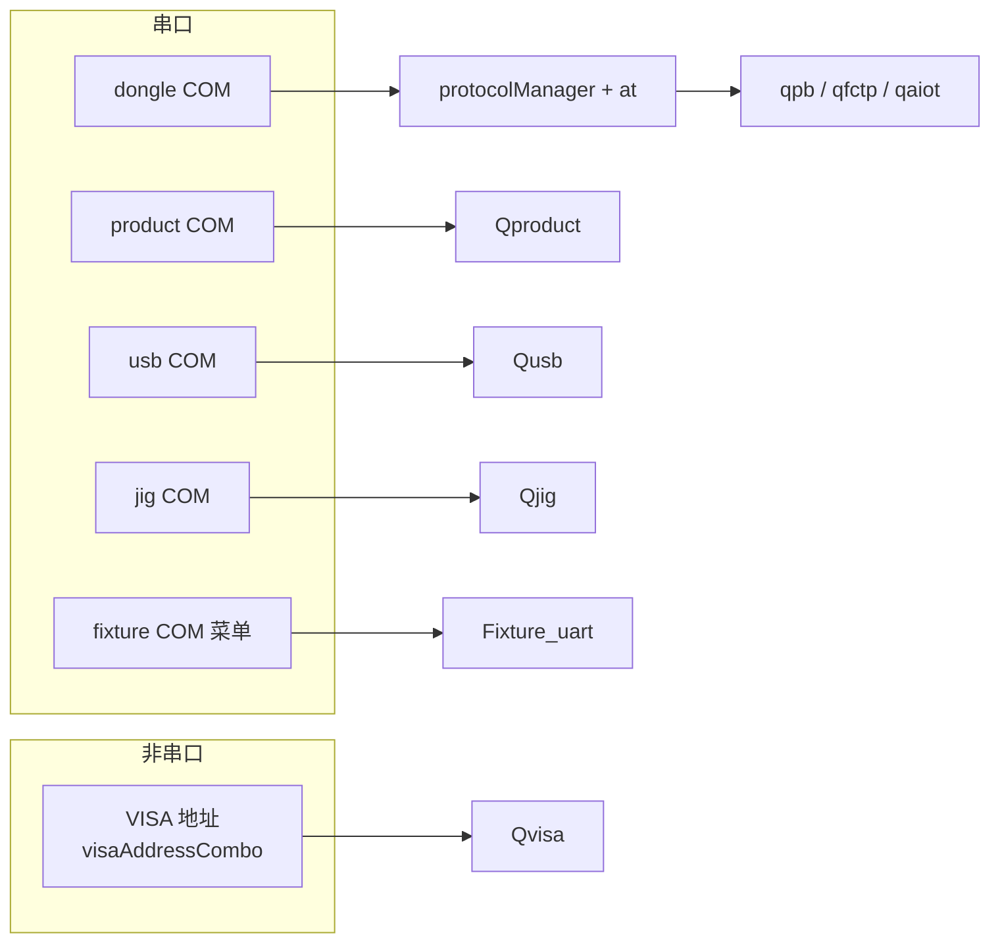
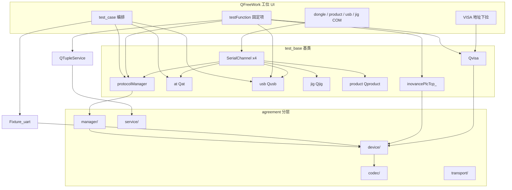

# 自由工站协议调用说明

> 说明 `work_station/freework/` 如何调用 `agreement/` 各层协议。  
> 目录重构后，**工站调用方式基本不变**——只改 `agreement` 内部路径与 `.pro` 的 `INCLUDEPATH`，业务代码仍通过 `test_base` 入口。

配套：[agreement目录分层重构方案.md](./agreement目录分层重构方案.md)、[agreement外设与治具说明.md](./agreement外设与治具说明.md)

---

## 1. 总览：工站只认「入口」，不认目录

### 1.1 串口与 VISA（物理通道）

**`Qvisa` 与 `Qusb` 无关**：前者走 **VISA 资源地址**（界面 `visaAddressCombo`，ini `FreeInstrument/VisaAddress`），后者走 **usb COM** 串口。二者不得混为同一路。



### 1.2 编排与 agreement 分层



**原则**：自由工站继续 `#include "qprotocolmanager.h"`，用 `protocolManager.set/get`，**不要**直接 include `codec/fctp/comm_protocol_builder.h`。

---

## 2. test_case 编排：按 Channel 分发

入口：`TestCaseRunner::beginStep`（`qfreework_test_case.cpp`）

| Channel | 自由工站调用 | 重构后层 | 串口 |
|---------|--------------|----------|------|
| **Product**（默认） | `protocolManager.set/get(DeviceCmd, …)` | manager → device/protocol/qfctp 等 | **dongle COM** |
| **Dongle** | `at->set/get(DongleCmd, …)` | device/peripheral/qat | dongle COM |
| **Fixture** | `executeFixturePcbaCase()` | device/peripheral/fixture + codec/fixture | **Fixture 独立 COM** |
| **Cloud** | `executeCloudTupleCase()` → `QTupleService` | service/tuple | HTTPS |
| **ProductSerial** | `executeProductSerialCase()` | device/product/qproduct | **product COM** |

### 2.1 产测协议（FCTP / PB / AIoT）

```cpp
protocolManager.set(DeviceCmd::FacMode, 1);
protocolManager.get(DeviceCmd::Sn, static_cast<int>(FacDevInfoType_TAIL_SN));
```

**收包路径**（工站无需改）：

```text
dongle COM → SerialChannel → onDongleSerialFrame()
    → protocolManager.parseCmd(data)
    → 信号 send_sn_data / send_button_state / …
    → QFreeWork::refreshSn / checkbutton / …
```

发令前（test_case）：

```cpp
ctx->setCommandWaitSource(CommandWaitSource::ProductProtocol);
ctx->sendCommandWithRetry(sendFn, timeoutMs);
```

### 2.2 治具 PCBA（Fixture 通道）

```cpp
// QFreeWorkBox 菜单「连接治具串口」
Fixture_uart* uart = box->fixtureUartWidget();
uart->sendPcbaFrame(frame);
connect(uart, &Fixture_uart::send_data_to_mechine, …);
```

实现：`executeFixturePcbaCase`（`qfreework_test_case.cpp`）。

### 2.3 云端三元组（Cloud 通道）

```cpp
QTupleService service;
service.get(TupleCmd::ApplyTupleByMac, applyMap);
// 设备侧写回仍走产测协议：
protocolManager.set(DeviceCmd::Sn, …);
protocolManager.get(DeviceCmd::TupleRead);
```

### 2.4 Dongle AT

```cpp
at->set(DongleCmd::BleScanConnect, param);
ctx->setCommandWaitSource(CommandWaitSource::DongleAt);
```

### 2.5 产品串口

```cpp
executeProductSerialCase(def);  // 内部操作 product->
```

### 2.6 VISA 测试仪器（CMW 等，非串口）

**无** `test_case` 的 `Send/Channel`；走界面地址 + `testFunction` / Hook。

```cpp
// 界面「保存并应用」→ prepareSession（地址来自 FreeInstrument/VisaAddress）
visa->prepareSession(VisaDeviceProfile::RxCmwInstrument, currentVisaAddress());
visa->set(VisaCmd::WriteLine, scpiCmd);
visa->get(VisaCmd::QueryLine, QStringLiteral("*IDN?"));
```

典型入口：`并联CMW播放*`（`testFunction`）、Hook `FREE_INSTR_CMW_GPRF_*`（`qfreework_case_hooks.cpp`）。

---

## 3. testFunction 固定测试项

| 能力 | 调用方式 | 重构后 |
|------|----------|--------|
| 读 SN、电量、WiFi、RSSI 等 | `protocolManager.set/get` | 同 Product |
| 读治具电流（项 57） | `usb->sendPowerInstruction(ReadMeasurement)` | device/peripheral/qusb（**usb COM**） |
| 并联 CMW 播放 / PER | `visa->prepareSession` + `runFreeInstrumentBleCmwBurstForBrushProfile` | device/peripheral/qvisa（**VISA 地址**） |
| 三元组 | `QTupleService` + `protocolManager` 写 SN/Key | service/tuple + manager |
| PLC 按键/旋钮 | `inovancePlcTcp_.connectPlc` / `readMCoils` / `writeMCoil` | device/modbus（后续可改 `modbusManager`） |
| MES 过站 | `send_end_testPass` → `MesManager`（`box_base` 连接） | service/mes |

PLC 当前为**直连** `inovancePlcTcp_`（成员在 `QFreeWork`）。统一 Modbus 后可改为：

```cpp
modbusManager.set(PlcCmd::Connect, connMap);
modbusManager.set(PlcCmd::WriteMCoil, param);
```

---

## 4. 串口与 VISA 绑定

### 4.1 四路 SerialChannel + 治具窗

| COM 下拉框 | 打开 | 收包 | 主要对象 |
|------------|------|------|----------|
| dongle | `openDongleSerialPort()` | `onDongleSerialFrame` | `protocolManager` + `at` |
| product | `openProductSerialPort()` | `onProductSerialFrame` | `product` |
| usb | `openUsbSerialPort()` | `onUsbSerialFrame` | `usb`（电流表/程控电源，**不是 VISA**） |
| jig | `openJigSerialPort()` | `onJigSerialFrame` | `jig`（自由工站用例**不发** jig 令） |
| fixture（菜单） | `Fixture_uart` 自管 | 窗口内部 | PCBA 治具（**独立 COM**） |

### 4.2 VISA（与上述串口并列，非 COM）

| 配置 | 说明 | 主要对象 |
|------|------|----------|
| `visaAddressCombo` +「刷新/保存并应用」 | `FreeInstrument/VisaAddress`、`FreeInstrument/VisaDeviceRole` | `visa`（NI-VISA，CMW/电源等） |

`test_base` 构造时绑定（重构后逻辑不变）：

```cpp
protocolManager.bindQpb(pb);
protocolManager.bindQfctp(qfctp);
protocolManager.bindQaiot(qaiot);
protocolManager.setCurrentProtocolType(...);  // SETTINGS SYSTEM/ProtocolType
// usb 绑 usbSerialPort；visa 为 new Qvisa(this)，无 QSerialPort
```

---

## 5. 调用规范

### 推荐（工站层）

- `protocolManager.set / get`（`parseCmd` 仅在 `test_base::onDongleSerialFrame`）
- `at->set / get`
- `usb->…`（**usb COM**）、`jig->parseCmd`（仅 test_base 收包）
- `visa->prepareSession` / `set` / `get`（**VISA 地址**，勿与 `usb` 混用）
- `QTupleService`、`inovancePlcTcp_` 或未来的 `modbusManager`
- `box->fixtureUartWidget()` → `Fixture_uart`

### 不推荐（工站直接碰底层）

- `#include "comm_protocol_builder.h"`
- 工站内直接 `new Qfctp`、直接写 `QSerialPort`

**例外**：`executeFixturePcbaCase` 可使用 `FixturePcbaUartProtocol::build*Command`，或后续封装为 `Fixture_uart::sendPcbaCmd`。

---

## 6. 重构后 include 与 API 映射

| 工站 API | 重构后位置 |
|----------|------------|
| `protocolManager` | `manager/qprotocolmanager.*` |
| `DeviceCmd` / `ProtocolSnData` 等 | `access/qprotocol_types.h` |
| `Qfctp`（test_base 构造） | `device/protocol/qfctp/` |
| `Fixture_uart` | `device/peripheral/fixture/` |
| `Qusb` / `Qjig` / `Qat` / `Qvisa` | `device/peripheral/*` |
| `Qproduct` | `device/product/qproduct/` |
| `InovanceH5uModbusTcp` | `device/modbus/` |
| `QTupleService` | `service/tuple/` |
| `SerialChannel` | `transport/serial_channel.*` |

`.pro` 增加 `INCLUDEPATH` 后，工站仍写短名：

```cpp
#include "qprotocolmanager.h"
#include "qfctp.h"
#include "fixture_uart.h"
#include "qtupleservice.h"
```

---

## 7. 入口小结

自由工站维护时只需记住：

1. **`protocolManager`** — 产测 FCTP/PB/AIoT（**dongle COM**）
2. **`at` / `usb` / `product` / `jig` / `Fixture_uart`** — 各 **COM** 或治具菜单窗（`usb` 为串口电流表，**不是** VISA）
3. **`visa`** — **VISA 资源地址**（CMW 播放等，与 `usb` 独立）
4. **`QTupleService` + `MesManager`（信号）** — 云端与 MES

目录分层为 `agreement` 内部服务，**不必**让 `qfreework*.cpp` 按层逐级调用。
