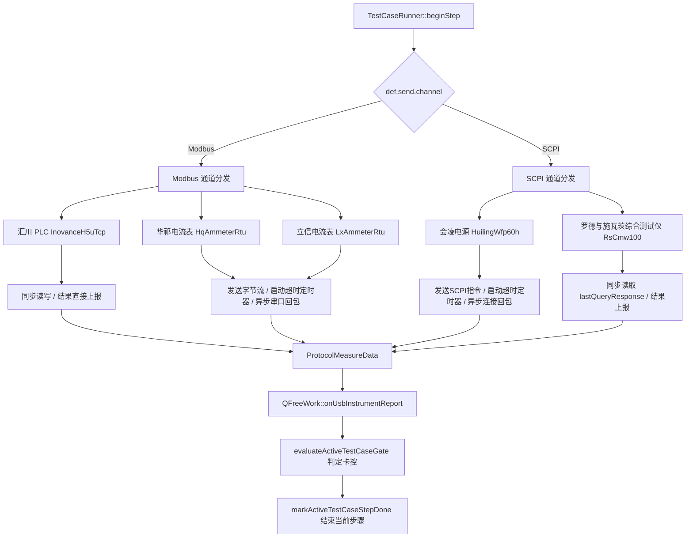

# 自由工站设备调用与指令发送设计说明

本文档详细说明在自由工站（`QFreeWork`）重构优化后的架构下，如何调用 Modbus 和 SCPI 外设并发送指令。

---

## 1. 核心流程概述

自由工站测试用例的执行入口为 [TestCaseRunner::beginStep](file:///f:/C/test/work_station/freework/qfreework_test_case.cpp#L392)。在执行每一个测试步骤时，系统会解析当前步骤在用例配置文件中定义的通道类型（`def.send.channel`），并据此将指令路由发送到相应的物理通道管理器中。

---

## 2. Modbus 通道设备调用

当通道类型为 `TestCaseSendChannel::Modbus` 时，主要逻辑如下：

### 2.1 路由设置与参数解析
1. **设备路由确定**：提取配置中的设备名 `def.send.device`，通过 [ModbusPeriphCmdCatalog::deviceFromIni](file:///f:/C/test/work_station/freework/qfreework_test_case.cpp#L440) 解析出对应的 `ModbusDeviceRoute` 枚举。
2. **设置管理器路由**：调用 `ctx->modbusManager.setDeviceRoute(devRoute)` 切换当前 [QModbusManager](file:///f:/C/test/agreement/modbus/manager/qmodbusmanager.h) 激活的设备路由并清空底层 RTU 接收状态。
3. **参数解析**：提取用例配置的指令参数并调用 `ctx->resolveTestCaseSendParamTree(def.send.param)` 解析动态占位符。

### 2.2 设备分发执行
* **汇川 PLC (`InovanceH5uTcp`)**：
  * **指令转换**：通过 `plcCmdFromName` 将指令字符串转换为 `PlcCmd` 枚举。
  * **同步读写**：调用 [QModbusManager::exec](file:///f:/C/test/agreement/modbus/manager/qmodbusmanager.cpp#L46) 同步执行 PLC 寄存器读写操作。
  * **结果返回**：如果是 `Get` 查询动作，直接将返回的 `resultVal` 打包为 `ProtocolMeasureData` 并调用 `ctx->onUsbInstrumentReport(...)` 上报；如果是 `Set` 控制动作，则当场结束步骤。
* **华祁 / 立信 RTU 电流表 (`HqAmmeterRtu` / `LxAmmeterRtu`)**：
  * **指令转换**：将指令名转为对应电流表的指令枚举 `HqAmmeterRtuCmd` 或 `LxAmmeterRtuCmd`。
  * **串口组帧发送**：调用模板函数 [QModbusManager::exec](file:///f:/C/test/agreement/modbus/manager/qmodbusmanager.h#L68)。该函数内部通过 `activeRtuDevice()` 找到对应的具体电流表驱动，调用其 `buildRequest` 组装成原始的请求 `QByteArray` 字节流，然后通过 `serialChannel_->write(payload)` 发出指令。
  * **异步等待与超时处理 (仅对于 `Get` 动作)**：
    * `exec` 下发成功后，在 `beginStep` 内部启动一个单次定时器 `QTimer::singleShot(timeoutMs, ...)` 进行超时拦截。
    * **回包接收**：物理串口收到字节流时，触发底层的接收插槽调用 `modbusManager.feedRtuRx`。解析模块提取并解析出电流值后发射 `rtuAmmeterReadingReceived` 信号。该信号在 [test_base::signalAndslot](file:///f:/C/test/work_station/test_base.cpp#L143) 中被关联并转发给 `onUsbInstrumentReport` 触发卡控，从而正常结束当前步骤。
    * 对于 `Set` 指令在发送完成后直接标记当前步骤通过。

---

## 3. SCPI 通道设备调用

当通道类型为 `TestCaseSendChannel::Scpi` 时，主要逻辑如下：

### 3.1 路由设置与参数解析
1. **设备路由确定**：提取配置中的设备名，通过 `ScpiPeriphCmdCatalog::deviceFromIni` 解析出 `ScpiDeviceRoute` 枚举。
2. **设置管理器路由**：调用 `ctx->scpiVisaManager()->setDeviceRoute(devRoute)` 切换当前 SCPI 仪器路由。
3. **参数解析**：提取并调用 `ctx->resolveTestCaseSendParamTree(def.send.param)` 解析参数。

### 3.2 设备分发执行
* **会凌可编程电源 (`HuilingWfp60h`)**：
  * **指令转换**：转换为电源对应的 SCPI 指令 `HuilingScpiCmd` 枚举。
  * **发送指令**：调用 `scpiVisaManager()->exec(cmd, resolvedParam, &errStr)` 发送 SCPI 写入包。
  * **异步读取与超时处理 (对于 `Get` 动作)**：
    * 启动一个超时定时器 `QTimer::singleShot`。
    * 当电源物理回传数据时，触发 `scpiVisaManager()->ammeterReadingReceived` 信号，在 [test_base::signalAndslot](file:///f:/C/test/work_station/test_base.cpp#L158) 中被捕获，包装为 `ProtocolMeasureData` 后上报到 `onUsbInstrumentReport` 触发 Gate 判定结束步骤。
    * 对于 `Set` 控制动作发送成功后直接结束步骤。
* **罗德与施瓦茨综合测试仪 (`RsCmw100`)**：
  * **指令转换**：转换为综合测试仪指令 `CmwScpiCmd` 枚举。
  * **发送指令**：调用 `scpiVisaManager()->exec(cmd, resolvedParam, &errStr)` 写入指令。
  * **同步读取 (对于 `Get` 动作)**：
    * 使用同步阻塞模式。在 `exec` 之后，在 `beginStep` 内部直接调用 `scpiVisaManager()->lastQueryResponse()` 获取到设备上报的响应内容，当场转换为 `ProtocolMeasureData` 格式上报到 `ctx->onUsbInstrumentReport(...)` 执行卡控判断。
    * 对于 `Set` 控制动作发送成功后直接结束步骤。

---

## 4. 判定卡控与步骤完成机制

获取到设备状态后，最终的数据流汇聚流程如下：

1. **上报处理**：[QFreeWork::onUsbInstrumentReport](file:///f:/C/test/work_station/freework/qfreework_data.cpp#L835) 接收到 `ProtocolMeasureData` 类型的数据上报。
2. **判定卡控门限**：调用 [QFreeWork::evaluateActiveTestCaseGate](file:///f:/C/test/work_station/freework/qfreework_test_case.cpp#L326)。该函数将实测数据类型、数值与用例中定义的门限上下限（Gate）进行对标与匹配，计算出 `pass`（是否通过）和判定细节。
3. **完成标记**：调用 `markActiveTestCaseStepDone` 更新 `testCaseStepResult_.done = true`，通知用例执行核心推进测试用例到下一步（或若卡控失败，根据策略重试或标记本步失败）。
